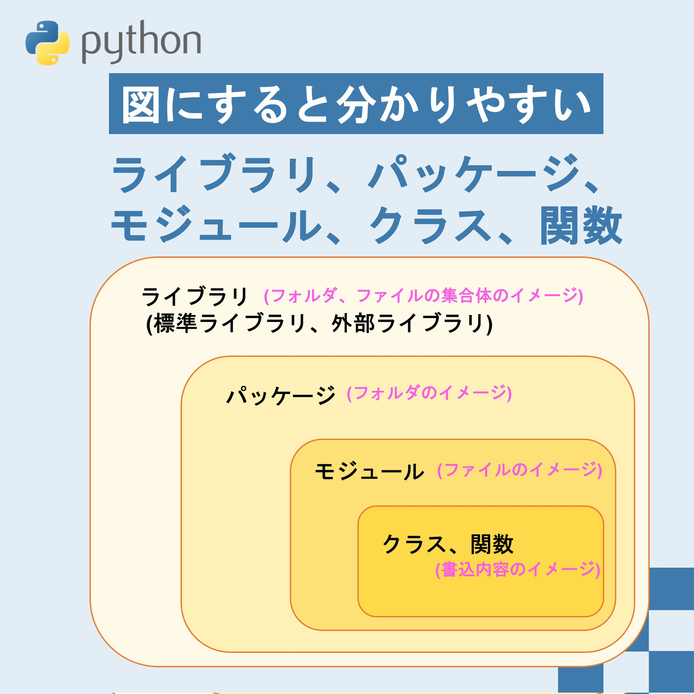

# Python 命名規則一覧

## はじめに

命名規則は、コードの可読性やチーム開発における一貫性を保つために非常に重要です。このドキュメントでは、Pythonの命名規則を一覧化し、具体例とともに説明します。また、Pythonコミュニティで推奨される[PEP8](http://pep8-ja.readthedocs.io/ja/latest/)の命名規則にも準拠しています。

---

## 命名規則の詳細

| 対象       | ルール                                    | 例                   |
| :--------- | :---------------------------------------- | :------------------- |
| パッケージ | 全小文字 なるべく短くアンダースコア非推奨 | tqdm, requests       |
| モジュール | 全小文字 なるべく短くアンダースコア可     | sys, os              |
| クラス     | 最初大文字 + 大文字区切り                 | MyFavoriteClass      |
| 例外       | 最初大文字 + 大文字区切り                 | MyCustomError        |
| 型変数     | 最初大文字 + 大文字区切り                 | MyFavoriteType       |
| メソッド   | 全小文字 + アンダースコア区切り           | my_favorite_method   |
| 関数       | 全小文字 + アンダースコア区切り           | my_favorite_function |
| 変数       | 全小文字 + アンダースコア区切り           | my_favorite_instance |
| 定数       | **全大文字** + アンダースコア区切り       | MY_FAVORITE_CONST    |

> **補足:**
> - C/C++ のモジュールは**アンダースコア**で開始します。
> - 自クラス内でのみ使用する内部変数と内部メソッドは、**アンダースコア**で開始します（例: `_private_method`）。

---

## Pythonのライブラリ構成

以下の図はPythonのライブラリ構成の一例です。この図はパッケージやモジュールの命名規則がどのように適用されるかを示しています。

> **図の概要:**
> この図では、パッケージやモジュールの配置と、それぞれの命名規則の適用例を視覚的に表しています。

---

## 命名規則の名前

以下は、命名規則でよく使用されるケースの種類とその具体例です。

| ケース名                                 | 例             | 意味                                                   |
| ---------------------------------------- | -------------- | ------------------------------------------------------ |
| スネークケース                           | hoge_hoge_hoge | 単語をアンダースコア区切りにしたもの                   |
| キャメルケース ロウアーキャメルケース | hogeHogeHoge   | 単語の先頭を大文字にしたもの(最初の単語は先頭が小文字) |
| パスカルケース アッパーキャメルケース | HogeHogeHoge   | 単語の先頭を大文字にしたもの(最初の単語も先頭が大文字) |
| ケバブケース                             | hoge-hoge-hoge | 単語をハイフン区切りにしたもの                         |

> **補足:**
> - スネークケースは、関数名や変数名に広く使用されます。
> - キャメルケースとパスカルケースは、クラス名や型名に適用されることが一般的です。

---

## 読み方

Pythonコードに登場するさまざまな括弧の種類と、それぞれの名称を以下に示します。

### 基本的な括弧の呼び方

| 型  | 日本語 | 英語        | 英語読み方   |
| --- | ------ | ----------- | ------------ |
| ()  | 丸括弧 | parenthesis | パレンティス |
| []  | 角括弧 | bracket     | ブラケット   |
| {}  | 波括弧 | braces      | ブレイシズ   |

### 特殊な括弧の呼び方

| 型   | 日本語     | 英語                 | 英語読み方                |
| ---- | ---------- | -------------------- | ------------------------- |
| 【】 | 隅付き括弧 | Gothic parenthesis   | ゴシック パレンティス     |
| 〈〉 | 山括弧     | Angle bracket        | アングル ブラケット       |
| 《》 | 二重山括弧 | Double Angle bracket | ダブルアングル ブラケット |

> **補足:**
> - これらの括弧の呼び方は、特にドキュメント作成やプレゼンテーションで便利です。

---

## 終わりに

命名規則を正しく理解し、一貫性を保つことで、コードの品質と可読性を向上させることができます。これらのルールを参考にしながら、自分やチームに適した命名規則を実践してください。

