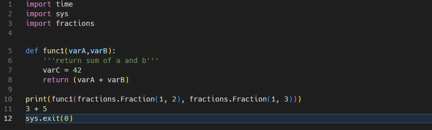
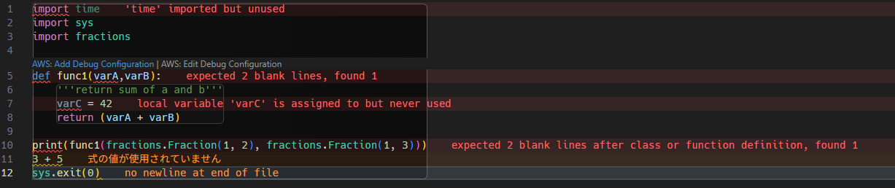

# PEP8:
- pythonのコーディング規約
    - 日本語版: https://pep8-ja.readthedocs.io/ja/latest/
    - 英語版: https://pep8.org/
- スタイルを統一し読みやすさを重視したコーディング方法

## 例
- インデントは4つのスペース
    ```python
    # NG 2 文字のインデント
    def insertion_sort(lst):
      for i in range(len(lst)):
        for j in range(i):
          if lst[j] > lst[i]:
            lst[j], lst[i] = lst[i], lst[j]
    ```
    ```python
    # OK 4 文字のインデント
    def insertion_sort(lst):
        n = len(lst)
        for i in range(n):
            for j in range(i):
                if lst[j] > lst[i]:
                    lst[j], lst[i] = lst[i], lst[j]
    ```
    - Pythonの標準的なインデントが4スペースであり、多くのエディタやIDEがこのスタンダードに基づいて設定されているためです。


- 関数は`全小文字+アンダースコア`区切り
    ```python
    # NG 関数名がキャメルケース
    def SayHelloPrint():
        print("hello")
    ```
    ```python
    # OK 小文字＋スネークケース
    def say_hello_print():
        print("hello")
    ```
    - Pythonでは、関数名は小文字とアンダースコアを使ったsnake_caseが推奨されています。

# コードスタイルチェックツール

- コードをチェックするためのツールの紹介
    1. pycestyle
    2. flake8
    3. pylint

- チェックを掛けるサンプルコードは以下
    ```python
    import time
    import sys
    import fractions

    def func1(varA,varB):
        '''return sum of a and b'''
        varC = 42
        return (varA + varB)

    print(func1(fractions.Fraction(1, 2), fractions.Fraction(1, 3)))
    3 + 5
    sys.exit(0)
    ```

## pycodestyle
### 用途
- スタイルチェック
    - PEP 8に準拠したコードスタイルをチェックします。

### インストール方法
```sh
$ pip install pycodestyle
```

### 使用方法
```sh
$ pycodestyle sample.py
```

### サンプルコードの実施結果
空白行、スペース不足の指摘
```sh
sample.py:5:1: E302 expected 2 blank lines, found 1
sample.py:5:15: E231 missing whitespace after ','
sample.py:13:12: W292 no newline at end of file
```


## flake8
### 用途
- スタイルチェック + エラー解析 + 複雑度チェック
    - pycodestyleに加え、コードの複雑度や未使用の変数、インポートなどもチェックします。

### インストール方法
```sh
$ pip install flake8
```

### 使用方法
```sh
$ flake8 sample.py
```

### サンプルコードの実施結果
pycodestyleに加え、モジュールや変数の利用実績チェック
```sh
sample.py:1:1: F401 'time' imported but unused
sample.py:5:1: E302 expected 2 blank lines, found 1
sample.py:5:5: N803 argument name should be lowercase
sample.py:5:15: E231 missing whitespace after ','
sample.py:7:5: F841 local variable 'varC' is assigned to but never used
sample.py:7:5: N806 variable in function should be lowercase
sample.py:13:12: W292 no newline at end of file
```


## pylint
### 用途
- スタイルチェック + 静的エラー解析 + レーティング出力
    - より詳細な静的解析を行い、コードの品質をレーティングします。

### インストール方法
```sh
$ pip install pylint
```

### 使用方法
```sh
$ pylint sample.py
```

### サンプルコードの実施結果
- より細かい指摘と、レーティング（この場合マイナス評価）。

```sh
************* Module sample
sample.py:5:14: C0326: Exactly one space required after comma
def func1(varA,varB):
              ^ (bad-whitespace)
sample.py:8:0: C0325: Unnecessary parens after 'return' keyword (superfluous-parens)
sample.py:13:0: C0304: Final newline missing (missing-final-newline)
sample.py:1:0: C0114: Missing module docstring (missing-module-docstring)
sample.py:5:0: C0103: Argument name "varA" doesn't conform to snake_case naming style (invalid-name)
sample.py:5:0: C0103: Argument name "varB" doesn't conform to snake_case naming style (invalid-name)
sample.py:7:4: C0103: Variable name "varC" doesn't conform to snake_case naming style (invalid-name)
sample.py:7:4: W0612: Unused variable 'varC' (unused-variable)
sample.py:12:0: W0104: Statement seems to have no effect (pointless-statement)
sample.py:1:0: W0611: Unused import time (unused-import)

------------------------------------
Your code has been rated at -1.11/10
```
- 上記の説明
    - C0326：カンマの後にスペースが必要
    - C0325：returnの後の括弧は不要
    - C0304：ファイルの最後に改行が必要
    - C0114：モジュールにdocstringが必要
    - C0103：変数名や引数名がPEP 8に準拠していない
    - W0612：変数が未使用
    - W0104：効果のないステートメント
    - W0611：importが未使用


# コードチェックツールの選択
## 厳しさ     

pylint > flake8 > pycodestyle

## 運用
- 最低でも`pycodestyle`は常に通す
- 号口・運用では`pylint`のレーティング`8`を目指すぐらいが良い


# 実際の使い方
- IDE(VSCodeやPycharm）に組みこむ方法がネットにあふれているため、調べると良い

    - [VSCode Pylint](https://www.google.com/search?q=VSCode+pylint&rlz=1C1QABZ_jaJP898JP898&oq=VSCode+pylint&aqs=chrome.0.69i59j0l5j69i61l2.2669j0j7&sourceid=chrome&ie=UTF-8)    
    - [Pycharm Pylint](https://www.google.com/search?q=pycharm+pylint&rlz=1C1QABZ_jaJP898JP898&oq=Pycharm+pylint&aqs=chrome.0.69i59j0l5j69i60l2.5678j0j7&sourceid=chrome&ie=UTF-8)

# おすすめVSCode拡張機能

## Error Lens
https://marketplace.visualstudio.com/items?itemName=usernamehw.errorlens

以下のような機能を提供してくれる
- エラー表示を波線から、ラインハイライトにする
- エラー内容をホバーや「問題」タブではなくインライン表示をする
    - Error Lensなし
    
    - Error Lensあり
    
