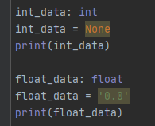

# 型ヒント（型アノテーション）

- Python3.5からType Hintsという機能が導入された
- Pythonは動的型付け言語のため、型の定義はできない
- Type Hintsは型に関する注釈(型アノテーション)をつけることができる

```python
# 型ヒントがない状態
def greeting(name):
    return 'Hello ' + name


# 型ヒントが有る状態
def greeting(name: str) -> str:
    return 'Hello ' + name
```

- `変数: 型`の形で型ヒントを書く
- 関数の返り値は `-> 型`の形で書く
- 上記の例はnameはstr型、returnされるのはstr型


## 使い方
- 型ヒントは処理に影響せず、***プログラム実行時には無視される***。（あくまでヒント）
- プログラムを書く際の手助けと、ドキュメンテーションとして可読性を上げる
- ***事前の静的解析***で型異常がないかをチェックできる

    - PyCharmでは画面上で型異常がチェックできる
      

## mypyでの静的解析
- mypyのインストール
  ```sh
  $ pip install mypy
  ```
  
- mypyの実行
  ```sh
  $ mypy main.py
  ```
  
  
- 実行結果
    - 問題なし
      ```sh
      $ mypy main.py
      Success: no issues found in 1 source file
      ```
      
    - 問題ある場合
      ```sh
      $ mypy main.py
      main.py:46: error: invalid syntax
      Found 1 error in 1 file (checked 1 source file)
      ```


# 型ヒント定義例

例として、すべて整数(int)型で示します。

## 変数定義

```python
a: int = 10
```

```python
a: int
a = 10
```


## 関数の引数定義

```python
def f(a: int):
    pass
```


```python
def f(a: int = 10):
    pass
```

## 関数の戻り値定義

```python
def f(a) -> int:
    return 10
```

```python
def f(a: int, b: int = 10) -> int:
    return a + b
```


# 型定義

## データ型で定義

| 名称         | 型    |
| ------------ | ----- |
| 整数         | int   |
| 浮動小数点数 | float |
| 文字列       | str   |
| バイト型     | bytes |
| 真理値       | bool  |
| None         | None  |

```python:TypeHints.py
int_data: int
int_data = 1

float_data: float
float_data = 0.0

str_data: str
str_data = '0.0'

bool_data: bool
bool_data = False

list_data: list
list_data = [1, 2, 3]

tuple_data: tuple
tuple_data = (1, 2, 3)

dict_data: dict
dict_data = {'x': 1, 'y': 2, 'z': 3}
```

## コンテナ系

コンテナ系は、内包する型を指定するので、 `list[int]` などと表記を行いたい。しかし、これはPythonの文法エラーとなってしまう。その為に、typingでは専用の型を準備している

```python
from typing import List, Tuple, Dict, Set
```

| 名称   | 型    | 定義例                            |
| ------ | ----- | --------------------------------- |
| リスト | List  | List[int]                         |
| タプル | Tuple | Tuple[int, int] / Tuple[int, ...] |
| 辞書   | Dict  | Dict[str, int]                    |
| セット | Set   | Set[int]                          |

```python:containerType.py
list_container: List[int]
list_container = [1, 2, 3, 4]
print(list_container)

dict_container: Dict[str, int]
dict_container = {'X': 1, 'Y': 2}
```

## 特殊な型


```python
from typing import Any
```

| 名称         | 型  | 定義例 |
| ------------ | --- | ------ |
| なんでもいい | Any | Any    |


```python

from typing import Callable, Iterator, MutableMapping
```

| 名称             | 型             | 定義例                       |
| ---------------- | -------------- | ---------------------------- |
| 呼び出し可能     | Callable       | Callable[[int, float], bool] |
| 繰り返し可能     | Iterator       | Iterator[int]                |
| 辞書のような挙動 | MutableMapping | MutableMapping[str, int]     |


# その他

## Optional

- Optionalは、指定の型 or Noneを、許容する型
- 例えば、整数とNoneのいずれかを許容する場合は、 `Optional[int]` とします。


```python
from typing import Optional

def f1(a: int, b: int) -> Optional[int]:
    if b == 0:
        return None
    return a // b
```

- 便利なのは以下の様に使えるからです。

    ```python
    def f2(c: Optional[int]) -> int:
        if c is None:
            c = 0
        return c + 100
    ```

    上記のケースを以下の様に記載すると、mypyがエラーを通知します。

    ```python
    def f2(c: Optional[int]) -> int:
        return c + 100
    ```

    ```
    $ mypy sample.py 
    sample.py:**: error: Unsupported operand types for + ("None" and "int")
    sample.py:**: note: Left operand is of type "Optional[int]"
    Found 1 error in 1 file (checked 1 source file)
    ```


- つまり、`int`と`None`の両方を受け付けることが可能なのに、`None`が入ってきた場合の処理がないため、エラーを出してくれる

## Union

- Unionは、2つのいずれかの型を示すことができます。
- 例えば、整数型 or 文字列型 と言った場合に、 `Union[int, str]` と指定します。

- 以下の様に引数を受け取るときに、整数か文字列かが分からないような場合に使い、 `isinstance` を使って処理を分けることで、上記のOptional同様に、変数の型を確定させる事ができます。

```python
from typing import Union

def f3(d: Union[int, str]) -> str:
    if not isinstance(d, str):
        d = str(d)
    return d.upper()
```

- ここでは、 `if not isinstance(d, str):` として、変数dが文字列型(str)でないときに、文字列に変換する処理を入れて処理を継続
- `return d.upper()` で、 `d` が文字列であることが分かっているので、安全に大文字に変換する文字列型のメソッドが使えています。


## int と float

intと指定してfloatは入れられませんが、その反対のfloatと指定してintを入れる事ができます。
以下の場合、 num4だけがエラーがでます。

```python
num1: float = 1.0
num2: float = 1
num3: int = 1
num4: int = 1.0  # これはエラーとなる
```

```
$ mypy sample/sample.py 
sample.py:**: error: Incompatible types in assignment (expression has type "float", variable has type "int")
```

これは、intをfloatに自動変換することができるが、その反対のfloatをintにすると情報を失うことがあることに起因しているそうです。

