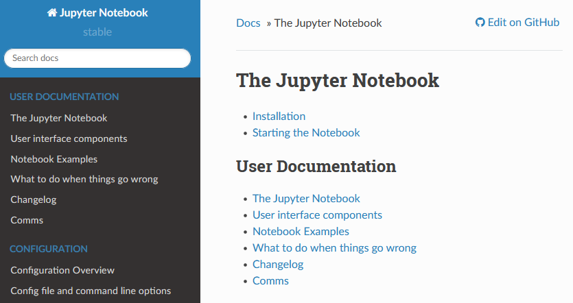
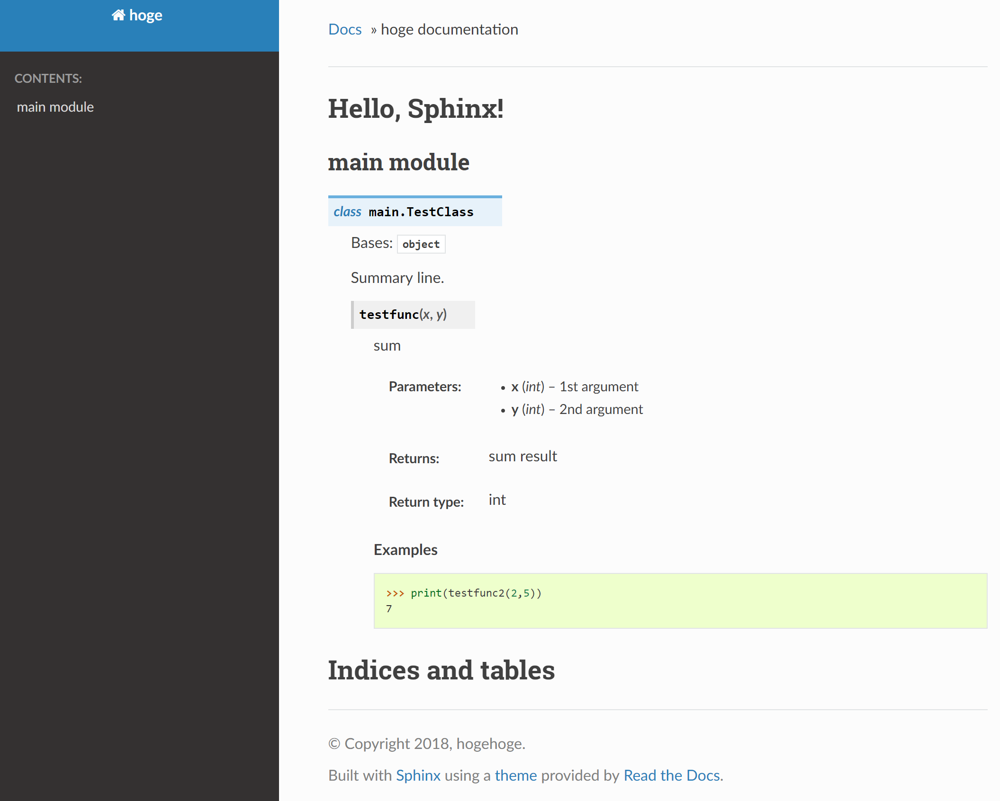

# Docstring
- Docstring（ドキュメンテーション文字列）は、Pythonコード内で関数、クラス、モジュールなどの説明を提供するための文字列。
- これは、開発者がコードの動作を理解しやすくするため、またAPIドキュメンテーションを自動生成するツールと連携するために使用されます。

## Docstringの書き方

- Docstringは、関数、クラス、またはモジュールの直下に配置される三重引用符（"""）で囲まれた文字列。
- 例えば、関数に対するDocstringは以下のように書くことができる。


```python 
def add(a: int, b: int) -> int:
    """2つの整数を足し合わせる関数
    
    Args:
        a (int): 足される整数
        b (int): 足す整数
    
    Returns:
        int: 2つの整数の和
    """
    return a + b
```


## Docstringのスタイル
- Docstringの書き方はいろんな書き方がある

### 1. Google スタイル
Googleスタイルは、読みやすさと明快さに焦点を当てたもので、多くのプロジェクトで使用されています。
```python
def function(a: int, b: str) -> str:
    """関数の概要

    Args:
        a (int): 説明
        b (str): 説明

    Returns:
        str: 戻り値の説明
    """
    pass
```


### 2. reStructuredText (reST) スタイル
reStructuredTextは、Sphinxのドキュメンテーションツールで一般的に使用されるスタイルです。
```python
def function(a: int, b: str) -> str:
    """関数の概要

    :param a: 説明
    :type a: int
    :param b: 説明
    :type b: str
    :return: 戻り値の説明
    :rtype: str
    """
    pass
```

### 3.  NumPy スタイル
科学計算や数値解析の分野でよく使われるNumPyスタイルも人気があります。

```python
def function(a: int, b: str) -> str:
    """関数の概要

    Parameters
    ----------
    a : int
        説明
    b : str
        説明

    Returns
    -------
    str
        戻り値の説明
    """
    pass
```


## Docstringからの自動ドキュメント生成
- Docstringを正しく書くと、ドキュメントを自動生成することができる
- Sphinxの例
    

1. Sphinx
    - Pythonプロジェクトのドキュメンテーション生成に広く使用されるツール。多くの出力形式をサポートし、拡張機能も豊富
    - サポートするスタイル
        - reStructuredText (reST)、 Googleスタイルなど
2. Doxygen
    - C++など多くの言語に対応したドキュメント生成ツール。設定ファイルのカスタマイズが可能。
    - サポートするスタイル
        - Doxygenスタイル、reSTなど
3. pydoc
    - Python標準ライブラリの一部で、コマンドラインやHTMLでのドキュメンテーション表示が可能。
    - サポートするスタイル
        - 標準的なPython Docstring
4. Epydoc
    - Epytext形式のDocstringに対応したツール。UMLクラスダイアグラムの自動生成などがある。
    - サポートするスタイル
        - Epytextスタイル

### 例
- このコードから
```python
class TestClass:
    """Summary line.
    """

    def testfunc(self, x, y):
        """sum

        Args:
            x (int): 1st argument
            y (int): 2nd argument

        Returns:
            int: sum result

        Examples:
            >>> print(testfunc(2,5))
            7
        """
        return x + y
```
- これが生成される（ただし変換ツールの用意などは必要）



___

## Docstringのプログラムからの取り出し

- Docstringは、`help`関数や`.__doc__`属性を使って取り出すことができます。これらを用いると、関数の説明を動的に表示することが可能となります。

```python
help(example_func)
print(example_func.__doc__)
```

出力:

```
Example function

    この関数は引数として整数と文字列を受け取り、それらを表示後にTrueを返します。

    Args:
        param1 (int): 表示する整数
        param2 (str): 表示する文字列

    Returns:
        bool: 処理が成功したかどうかを示す。この関数では常にTrueを返します。
```

___

- Pythonの組み込み関数やサードパーティのライブラリでも、ほとんどの関数やクラスにはDocstringが用意されている。

```python
import pandas as pd

help(pd.DataFrame)
```