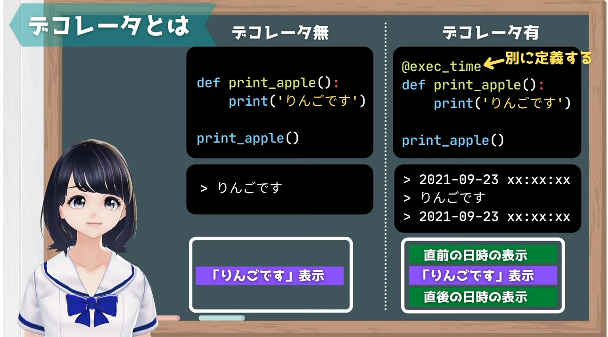

# デコレータ ～初心者向け解説～

デコレータはPythonの非常に強力な機能で、関数やメソッドに新たな機能を追加するための便利なツールです。ただし、その仕組みを理解するのは初心者にとって少し難しいかもしれません。このドキュメントでは、デコレータの基本概念から具体的な活用例まで、段階的に解説します。

---

## デコレータとは？

デコレータは、**「関数やメソッドに新しい動作を追加する仕組み」**です。たとえば、関数の実行前後に何らかの処理を追加したいとき、デコレータを使うと元の関数を修正することなく実現できます。

### イメージ
- 関数 `A` に対して「何かの処理」を付け加えたい。
- この「何かの処理」をデコレータとして関数に適用します。



https://www.youtube.com/@pythonvtuber9917

---

## デコレータの基本構造

以下はデコレータの基本的な仕組みを示した例です。

### デコレータの作成

```python
# デコレータの定義
def print_info(func):
    def wrapper(*args, **kwargs):
        print("処理前: デコレータの処理を追加")
        result = func(*args, **kwargs)  # 元の関数を実行
        print("処理後: デコレータの処理を追加")
        return result
    return wrapper
```

### デコレータの適用

```python
@print_info
def add_num(a, b):
    return a + b

# 関数を呼び出す
result = add_num(10, 20)
print(f"結果: {result}")
```

実行結果：
```
処理前: デコレータの処理を追加
処理後: デコレータの処理を追加
結果: 30
```

### 解説
- `@print_info` を関数の上に記載することで、`add_num` 関数がデコレータで装飾されます。
- デコレータは、関数の実行前後に独自の処理を挿入できます。

---

## 実用例

### 1. 関数の処理時間を計測するデコレータ

デコレータを使って、関数の処理時間を計測することができます。

```python
import time
from functools import wraps

def timer_decorator(func):
    @wraps(func)
    def wrapper(*args, **kwargs):
        start_time = time.time()
        result = func(*args, **kwargs)
        end_time = time.time()
        elapsed_time = end_time - start_time
        print(f"{func.__name__} took {elapsed_time:.6f} seconds")
        return result
    return wrapper

@timer_decorator
def example_function(duration):
    time.sleep(duration)

example_function(2)
```

実行結果：
```
example_function took 2.000123 seconds
```

### 2. ログを記録するデコレータ

関数の実行ログを記録するデコレータの例です。

```python
from functools import wraps

def log_decorator(func):
    @wraps(func)
    def wrapper(*args, **kwargs):
        print(f"実行: {func.__name__} with args: {args}, kwargs: {kwargs}")
        result = func(*args, **kwargs)
        print(f"終了: {func.__name__} with result: {result}")
        return result
    return wrapper

@log_decorator
def multiply(a, b):
    return a * b

multiply(5, 10)
```

実行結果：
```
実行: multiply with args: (5, 10), kwargs: {}
終了: multiply with result: 50
```

---

## 複数デコレータの使用

1つの関数に複数のデコレータを適用することも可能です。

```python
def decorator_one(func):
    def wrapper(*args, **kwargs):
        print("デコレータ1: 処理開始")
        result = func(*args, **kwargs)
        print("デコレータ1: 処理終了")
        return result
    return wrapper

def decorator_two(func):
    def wrapper(*args, **kwargs):
        print("デコレータ2: 処理開始")
        result = func(*args, **kwargs)
        print("デコレータ2: 処理終了")
        return result
    return wrapper

@decorator_one
@decorator_two
def add(a, b):
    return a + b

add(3, 4)
```

実行結果：
```
デコレータ1: 処理開始
デコレータ2: 処理開始
デコレータ2: 処理終了
デコレータ1: 処理終了
```

### デコレータの適用順序
- 最も内側にあるデコレータ（下に記述されたもの）が最初に実行されます。
- 記述順序による違いに注意しましょう。

---

## デコレータのメリット

1. **再利用性**
   - 共通の処理を1か所にまとめ、複数の関数で再利用可能。

2. **コードの簡潔化**
   - 関数内に冗長な処理を書く必要がなくなる。

3. **可読性の向上**
   - 関数に追加された処理が明示的にわかる。

---

## 注意点

1. **デバッグの難しさ**
   - デコレータが絡むコードはデバッグが難しい場合があります。

2. **@wrapsの使用**
   - デコレータ内で `@wraps` を使用しないと、元の関数情報（名前、Docstringなど）が失われる可能性があります。

---

## まとめ

デコレータは、関数やメソッドに新しい動作を追加するための便利なツールです。適切に使用することで、コードの再利用性や可読性を向上させることができます。このドキュメントで紹介した基本構造と実用例を参考に、デコレータの力を活用してみてください！

