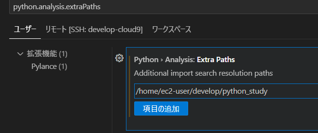

Pythonでは、特定の機能をまとめたスクリプトをモジュールとして作成し、他のスクリプトからimportして使うことができます。これにより、コードの再利用や共有が容易になります。


# 独自モジュールのディレクトリ構成

- 下記のようなディレクトリ構成でモジュールを作成する
- 例として`sample_package`モジュールパッケージを作る

    ```sh
    .
    ├── sample_package  : モジュールパッケージをディレクトリで区切る
    │   ├── __init__.py : モジュールパッケージがあるディレクトリであることを示すファイル
    │   ├── utils.py    : モジュールの実態ファイル 1
    │   └── utils_pro.py: モジュールの実態ファイル 2 
    ├── main.py         : main用Pythonスクリプト
    ```

- `utils.py`
    ```python
    # 入った文字列を2回 + ! して返す
    def say_twice(word):
        return (word + '! ') * 2
    ```
    
- `main.py`
    main.pyからutils.pyの呼び出し方
    
    ```python
    import sample_package.utils

    r = sample_package.utils.say_twice('hello')
    print(r)
    ```
    ```sh
    hello! hello! 
    ```
    
## importを短くできる

1. 特定のモジュールだけをimportする
    ```python
    # import sample_package.utils
    from sample_package import utils

    # r = sample_package.utils.say_twice('hello')
    r = utils.say_twice('hello')

    print(r)
    ```
    
2. 関数だけをインポートする
    ```python
    # import sample_package.utils
    # from sample_package import utils
    from sample_package.utils import say_twice

    # r = sample_package.utils.say_twice('hello')
    # r = utils.say_twice('hello')
    r = say_twice('hello')
    ```
    
## 注意
- 関数のみのインポートは後々の可読性が悪いため、避けるようにする。
- 最低でもモジュールインポート`1.`までにする
- フルパスでのインポートは可読性は高いが、コード量が多くなるため、モジュールインポートがおすすめ


## VSCodeに関しての注意
- 注意点
    - VSCodeにおいては上記の方法ではうまくimportできない
    - VSCode側が認識しているPythonそのもののパスと、プログラムを書いているパスに違いがあるため
- 対応方法
    - settings.jsonにpython.analysis.extraPathsに読み込みたいパスを追加することで解決。
    - 