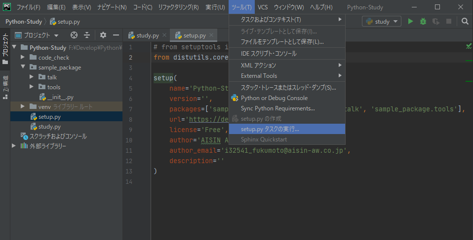

# Python パッケージの作成と配布方法

Python のパッケージ作成と配布について説明します。Python のパッケージは、複数のモジュールやデータ、リソースを一つにまとめたもので、再利用や共有を容易にします。

## パッケージの基本的な構造

Python パッケージは、基本的に次のようなディレクトリ構造を持ちます。

```
mypackage/
    mypackage/
        __init__.py
        module1.py
        module2.py
    setup.py
    README.md
```

* `mypackage/`：パッケージのルートディレクトリです。ここに setup.py や README.md などのファイルを置きます。
* `mypackage/mypackage/`：パッケージの本体が入るディレクトリです。Python のモジュールがこのディレクトリに入ります。
* `mypackage/mypackage/__init__.py`：このファイルがあることで、Python はこのディレクトリをパッケージとして認識します。
* `mypackage/mypackage/module1.py`：Python のモジュールです。関数やクラスを定義します。
* `mypackage/setup.py`：パッケージのメタデータや依存関係を定義するためのスクリプトです。

## `setup.py` の作成

`setup.py` は、パッケージのメタデータを定義する重要なファイルです。以下に、基本的な `setup.py` の例を示します。

```python
from setuptools import setup, find_packages

setup(
    name="mypackage",
    version="0.1",
    packages=find_packages(),
    author="Your Name",
    author_email="your.email@example.com",
    description="A brief description of your package.",
)
```

## パッケージのビルドと配布

ビルドと配布は、Python のパッケージ管理ツールである `pip` を使用します。まず、パッケージをビルドします。

```bash
python setup.py sdist
```

次に、生成されたディストリビューションアーカイブ（.tar.gz ファイル）を PyPI（Python Package Index）にアップロードします。ただし、これを行うには PyPI のアカウントが必要です。

```bash
pip install twine
twine upload dist/*
```

以上が、Python パッケージの基本的な作成と配布方法になります。パッケージの作成は Python の再利用と共有を容易にし、より大規模なプロジェクトに対応するための重要なスキルです。


<br><br><br><br>
<br><br>
<br><br>

---------------------------------------
# PyCharm編
## 前提

- setup.pyを自動生成できるPyCharm推奨。
- VSCodeでは手動生成のみ
- 本記事ではPyCharmでの例を示す


## setup.pyの作成（distutils）
1. ツール　→　setup.pyの作成
    
    
2.　必要情報の入力
    
    
1. 自動的に`setup.py`が生成される
    ```python:setup.py
    from distutils.core import setup

    setup(
        name='Python-Study',
        version='',
        packages=['sample_package', 'sample_package.talk', 'sample_package.tools'],
        url='https://dev-growi.aw-connected.com',
        license='Free',
        author='AISIN AW CO., LTD.',
        author_email='i32541_fukumoto@aisin-aw.co.jp',
        description=''
    )
    ```
    
    - PyCharmの設定によっては`from setuptools import setup`がインポートされる
    - `setuptools`は`distutils`の拡張版。ここでは`distutils`ですすめる
    

## setup.pyを実行して、パッケージを作成する（PyCharm自動）
1. ツール → setup.pyタスクの実行
   
   
2. sdistを選択し実行する
   
   
3. 成果物として、`dist`ディレクトリにパッケージをtar-ballで固めたものが出来上がる
   

5. パッケージの中身の説明として、`MANIFEST`ファイルが出来上がる

```txt:MANIFEST
# file GENERATED by distutils, do NOT edit
setup.py
sample_package\__init__.py
sample_package\talk\__init__.py
sample_package\talk\animal.py
sample_package\talk\human.py
sample_package\tools\__init__.py
sample_package\tools\utils.py
```

## setup.pyを実行して、パッケージを作成する（手作業）
1. コマンドラインから下記を実行
    ```sh
    $ python setup.py sdist
    ```
    
2. パッケージのtar-ballとMANIFESTが出来上がる


## 出来上がったパッケージをインストールする

- 作成したtarballをinstallしてあげる
    ```sh
    python install xxxxx.tar.gz
    ```