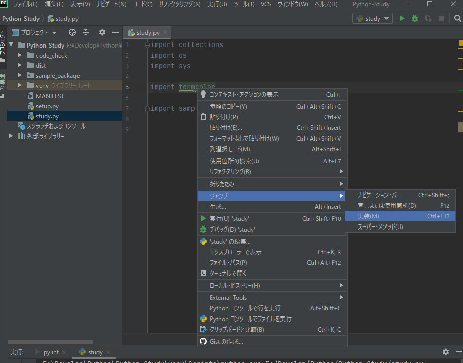

```python
import collections
import os
import sys

import termcolor

import sample_package
```

## PyCharmでの確認方法

- パッケージ名を右クリック → ジャンプ → 実装
    
    
    
    
## 直接確認する方法
```python
import collections
import os
import sys

import termcolor

import sample_package

print(collections.__file__)
print(termcolor.__file__)
print(sample_package.__file__)

print(sys.path)
```

```sh
C:\Python\Python37\lib\collections\__init__.py
F:\Develop\Python\Python-Study\venv\lib\site-packages\termcolor.py
F:\Develop\Python\Python-Study\sample_package\__init__.py
['F:\\Develop\\Python\\Python-Study', 'F:\\Develop\\Python\\Python-Study', 'C:\\Python\\Python37\\python37.zip', 'C:\\Python\\Python37\\DLLs', 'C:\\Python\\Python37\\lib', 'C:\\Python\\Python37', 'F:\\Develop\\Python\\Python-Study\\venv', 'F:\\Develop\\Python\\Python-Study\\venv\\lib\\site-packages']
```