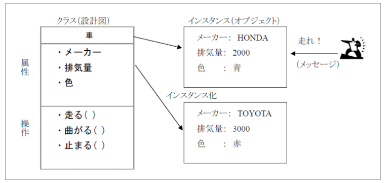

# プロパティとは


- クラスの属性情報を表すもの

## Python でのプロパティアクセス
- クラスへのプロパティへのアクセスはできるだけ容易であること（プロパティ設定）
- 基本的にプロパティは書き換えしないため、取得専用のアクセス方法が用意される（Getter）
- 例外的にプロパティの書き換えを行うシーンが有るため、書き換え専用のアクセス方法が用意される（Setter）


## 1. サンプルクラス

- `Cat`クラスに初期値としてname='ミケ'
    ```python
    class Cat:
        def __init__(self):
            self.name = 'ミケ'


    cat = Cat()
    print(cat.name)
    ```

- 実行結果
    ```sh
    ミケ
    ```
    
## 2. クラス内メソッドの変数名を変えると発生する問題

- メソッドの変数を変える場合
    ```python
    # 名前をcat_nameに変えたら、
    class Cat:
        def __init__(self):
            self.cat_name = 'ミケ'

    # プログラム側も全部変える必要がある
    cat = Cat()
    # print(cat.name)
    print(cat.cat_name)
    ```


- プログラム側も全部変える必要があり、変更量が多くなる
- `.変数名`で簡単にアクセスできて、クラス側の変更対応も容易にしたい
- このために設定するものが　`プロパティ`


## 3. プロパティの書き方順番

1. プロパティの設定
2. プロパティの値を取り出すためのGetterの設定
3. プロパティの値を設定するSetterの設定


## 4. プロパティの設定

- 書き方。デコレータで`@property`
    ```python
    @property
    def プロパティ名(self):
        pass
    ```
    
- Catクラスのnameをプロパティで背彫っていする
    ```python 
    # Catクラスのnameをプロパティにする
    class Cat:
        def __init__(self):
            self.__name = 'ミケ'

        @property
        def name(self):
            pass
    ```
    
- **重要事項**
    - nameは直接アクセスできなくなるようにプライベート変数である__がついている
    - これは必須事項である


## 5. Getterの設定

- 書き方。デコレータで`@プロパティ名.getter`

    ```python
    @プロパティ名.getter
    def プロパティ名(self):
        return self.変数名
    ```

- Getterの設定
    ```python
    class Cat:
        def __init__(self):
            self.__name = 'ミケ'

        @property
        def name(self):
            pass

        @name.getter
        def name(self):
            print('name.getterが呼ばれました')
            return self.__name


    # アクセス方法は同じで.変数名
    cat = Cat()
    print(cat.name)
    ```

- 実行結果
    ```sh
    name.getterが呼ばれました
    ミケ
    ```
    
    
## 6. Getterの省略（この書き方が多い）

- `@property`のreturnで値を返すことで、Getter処理になる
    ```python
    class Cat:
        def __init__(self):
            self.__name = 'ミケ'

        @property
        def name(self):
            return self.__name

    # @propertyのところに直接ゲッターの処理内容を書いています。

    cat = Cat()
    print(cat.name)
    ```
    
- 実行結果
    ```sh
    name.getterが呼ばれました
    ミケ
    ```
    
    
## 7. Setterの設定

- 書き方。デコレータで`@プロパティ名.setter`

    ```python
    @プロパティ名.setter
    def プロパティ名(self, val):
        self.変数名 = val
    ```

- Setterの設定
    ```python
    class Cat:
        def __init__(self):
            self.__name = 'ミケ'

        @property
        def name(self):
            return self.__name

        @name.setter
        def name(self, name):
            self.__name = name

    # cat1にはnameに`タマ`を設定する
    cat1 = Cat()
    cat1.name = 'タマ'
    print(cat1.name)

    # 新しいcat2のnameは書き換わっていない
    cat2 = Cat()
    print(cat2.name)
    ```
    
- 実行結果
    ```sh
    タマ
    ミケ
    ```

    
## 8. Setterでのバリデーション

- Setterでバリデーションすることで、変な値が入らないようにできる
- 変な値が入ったときは、エクセプションを上げる

```python
class Cat:
    def __init__(self):
        self.__name = 'ミケ'

    @property
    def name(self):
        return self.__name

    @name.setter
    def name(self, name):
        if name is None:  # nameがNoneならエラーをraise
            raise TypeError('invalid name')
        self.__name = name


cat = Cat()
cat.name = None
print(cat.name)
```