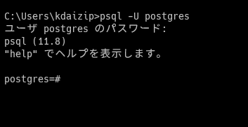

- 下記のインストール方法は参考手順です。
- Docker等で導入するなど任意の方法でOK
    - `sqlite3.exe` , `mysql.exe`, `psql.exe` が動作すれば何でもOK
- Windows版のみを記載する

# SQLite3

## インストール
1. 公式サイトからダウンロード
   https://www.sqlite.org/download.html
   
2. ダウンロードしたファイルを任意の場所に解凍
    - `C:\SQLite3`など

3. 必要に応じて、`sqlite3.exe`のPATHを環境変数に登録

## 動作確認
1. コマンドプロンプトで`sqlite3`実行

```cmd
C:\Users\kdaizip>sqlite3
SQLite version 3.32.3 2020-06-18 14:00:33
Enter ".help" for usage hints.
Connected to a transient in-memory database.
Use ".open FILENAME" to reopen on a persistent database.
sqlite>
```


# MySQL
## インストール
- ここではインストーラは利用せず、実行ファイルをZIP圧縮したものを使う
- インストーラはたくさんの機能が同時にインストールされるため、ホスト汚してしまう
    https://qiita.com/sireline/items/0c2d7d308d3c9722e48d
    https://qiita.com/KOJI-YAMAMOTO/items/02af20e7b5cd27932a27

- 可能であれば、Docker経由できれいにインストールすること
  https://qiita.com/A-Kira/items/f401aea261693c395966


## 動作確認
```cmd

C:\Users\kdaizip>mysqld --console
2020-08-03T07:12:48.311942Z 0 [System] [MY-010116] [Server] C:\DB\mysql\bin\mysqld.exe (mysqld 8.0.21) starting as process 4628
2020-08-03T07:12:48.330320Z 1 [System] [MY-013576] [InnoDB] InnoDB initialization has started.
2020-08-03T07:12:48.331894Z 1 [ERROR] [MY-012271] [InnoDB] The innodb_system data file 'ibdata1' must be writable
2020-08-03T07:12:48.332032Z 1 [ERROR] [MY-012278] [InnoDB] The innodb_system data file 'ibdata1' must be writable
2020-08-03T07:12:48.332177Z 1 [ERROR] [MY-010334] [Server] Failed to initialize DD Storage Engine
2020-08-03T07:12:48.332524Z 0 [ERROR] [MY-010020] [Server] Data Dictionary initialization failed.
2020-08-03T07:12:48.332770Z 0 [ERROR] [MY-010119] [Server] Aborting
2020-08-03T07:12:48.333749Z 0 [System] [MY-010910] [Server] C:\DB\mysql\bin\mysqld.exe: Shutdown complete (mysqld 8.0.21)  MySQL Community Server - GPL.

C:\Users\kdaizip>mysql -u root -p
Enter password: *****
Welcome to the MySQL monitor.  Commands end with ; or \g.
Your MySQL connection id is 15
Server version: 8.0.21 MySQL Community Server - GPL

Copyright (c) 2000, 2020, Oracle and/or its affiliates. All rights reserved.

Oracle is a registered trademark of Oracle Corporation and/or its
affiliates. Other names may be trademarks of their respective
owners.

Type 'help;' or '\h' for help. Type '\c' to clear the current input statement.

mysql>
```


# PostgreSQL
## インストール
- 下記参照
  https://www.flyenginer.com/low/low_db/zip%E3%83%95%E3%82%A1%E3%82%A4%E3%83%AB%E3%81%A7postgresql12%E3%82%92%E3%82%A4%E3%83%B3%E3%82%B9%E3%83%88%E3%83%BC%E3%83%AB%E3%81%99%E3%82%8B.html


## 動作確認
```cmd
p>psql -U postgres
ユーザ postgres のパスワード:
psql (11.8)
"help" でヘルプを表示します。

postgres=#
```


