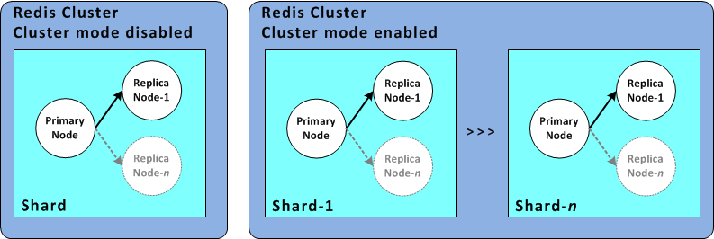

## Redisとは
Key-Value型に分類されるインメモリDBのこと。
同じインメモリDBであるmemchachedと比較すると多くのデータ型がサポートされている。
- 文字列型
- リスト型
- ハッシュ型
- セット型(集合)
- ソート済セット型

インメモリDBのため通常Redisを落とすと登録されたデータが消滅するが、設定次第でデータの永続化も可能。
永続化方法にはデータベースの内容をそのままディスクに書き出す方法とコマンド操作の内容を全てファイルに書き出す方式(AOF:Append Only File)がある。

DBごとに名称はつかず、0~15の数字が割り振られ、接続時にはその番号を指定する必要がある。

## インストール・起動方法
### linuxの場合(未検証)
[【参考ページ】](https://qiita.com/wind-up-bird/items/f2d41d08e86789322c71)

```
sudo apt install redis-server
sudo systemctl start redis-server.service
```

### Windowsの場合
githubからzipファイルをダウンロード
https://github.com/MicrosoftArchive/redis/releases

解凍先フォルダのredis-server.exeを起動する。
何も指定がない場合はポートはデフォルトの6379で起動される。


## 接続方法
### java
redis接続ライブラリであるjedisを使用する。
- build.gradle
```
dependencies {
    compile group: 'redis.clients', name: 'jedis', version: '2.6.0'
}
```
- RedisClient.java
```
import redis.clients.jedis.*;

public class RedisClient {

    JedisPool pool;

    public RedisClient(){}

    // Redisへの接続を取得
    private Jedis getResource()
    {
        synchronized (this) {
            if(pool == null || pool.isClosed())
            {
                // ConnectionPoolの設定
                GenericObjectPoolConfig jedisPoolConfig = new GenericObjectPoolConfig();
                pool = new JedisPool(jedisPoolConfig, "localhost");
            }
        }

        return pool.getResource();
    }
    ~~~~~~ 中略 ~~~~~~
    
    // jedisクライアント取得(以後このjedisインスタンスを使用してRedis操作を行う)
    Jedis jedis = getResource();
```
ここでポートやDB番号を指定しない場合デフォルト値(ポート:6379, DB番号:0)が使用される。

### python
事前準備としてredisパッケージをインストール
```
pip install redis
```
- redis_sample.py(ファイル名をredis.pyにするとエラーが発生するため注意)
```
import redis

pool = redis.ConnectionPool(host='localhost', port=6379, db=0)
# jedisクライアント取得(以後このインスタンスを使用してRedis操作を行う)
r = redis.StrictRedis(connection_pool=pool)
```

## データ操作
JavaとPythonでメソッド名や使用方法に大きく差はないため、Pythonコードのみを例にとり説明を行う
### 文字列型
- set
```
r.set('strKey1', 'hogehoge')
r.set('strKey2', 'hugahuga')
```

- get
```
print('strKey1:' + r.get('strKey1').decode())
print('strKey2:' + r.get('strKey2').decode())
```
※結果は全てバイナリで返ってくるため文字列として扱う場合はデコードが必要となる。

結果
```
strKey1:hogehoge
strKey2:hugahuga
```

### リスト型
- set
```
print('要素をセットする')
r.lpush('listKey', 'AAA')
print(r.lrange('listKey', 0, -1))

print('複数要素を先頭に追加する')
r.lpush('listKey', 'BBB', 'CCC')
print(r.lrange('listKey', 0, -1))

print('要素を末尾に追加する')
r.rpush('listKey', '111')
print(r.lrange('listKey', 0, -1))

print('要素AAAの後ろに要素XXXを挿入する')
r.linsert('listKey', 'after', 'AAA', 'XXX')
print(r.lrange('listKey', 0, -1))

print('要素CCCの前に要素YYYを挿入する')
r.linsert('listKey', 'before', 'CCC', 'YYY')
print(r.lrange('listKey', 0, -1))
```

- get
```
print('全件取得')
print(r.lrange('listKey', 0, -1))

print('2番目から4番目の要素を取得(先頭要素は0番目とする)')
print(r.lrange('listKey', 2, 4))

print('4番目の要素を取得')
print(r.lindex ('listKey', 4))

print('先頭要素を取り出し削除')
print(r.lpop('listKey'))

print('末尾要素を取り出し削除')
print(r.rpop('listKey'))

print('再び全件取得')
print(r.lrange('listKey', 0, -1))
```

結果
```
要素をセットする
[b'AAA']
複数要素を先頭に追加する
[b'CCC', b'BBB', b'AAA']
要素を末尾に追加する
[b'CCC', b'BBB', b'AAA', b'111']
要素AAAの後ろに要素XXXを挿入する
[b'CCC', b'BBB', b'AAA', b'XXX', b'111']
要素CCCの前に要素YYYを挿入する
[b'YYY', b'CCC', b'BBB', b'AAA', b'XXX', b'111']
全件取得
[b'YYY', b'CCC', b'BBB', b'AAA', b'XXX', b'111']
2番目から4番目の要素を取得(先頭要素は0番目とする)
[b'BBB', b'AAA', b'XXX']
4番目の要素を取得
b'XXX'
先頭要素を取り出し削除
b'YYY'
末尾要素を取り出し削除
b'111'
再び全件取得
[b'CCC', b'BBB', b'AAA', b'XXX']
```

### ハッシュ型
- set
```
print('ハッシュマップをセット')
r.hmset('car1', {'cartype': 'Prius', 'color': 'white'})
print(r.hgetall('car1'))

print('ハッシュマップに要素を追加')
r.hset('car1', 'owner', 'Suzuki')
print(r.hgetall('car1'))

print('ハッシュマップに既存のキーの要素を更新')
r.hset('car1', 'owner', 'Tanaka')
print(r.hgetall('car1'))
```

- get
```
print('ハッシュマップ全体を取得')
print(r.hgetall('car1'))

print('ハッシュマップの特定のキーを取得')
print(r.hget('car1', 'cartype'))

print('ハッシュマップのキーを複数指定して取得')
print(r.hmget('car1', 'cartype', 'owner'))

print('ハッシュマップのキー一覧を取得')
print(r.hkeys('car1'))

print('ハッシュマップの値一覧を取得')
print(r.hvals('car1'))

print('ハッシュマップの特定キーの存在をチェック')
print('キーがあるとき')
print(r.hexists('car1', 'color'))
print('キーがないとき')
print(r.hexists('car1', 'carnumber'))
```

結果
```
ハッシュマップをセット
{b'cartype': b'Prius', b'color': b'white'}
ハッシュマップに要素を追加
{b'cartype': b'Prius', b'color': b'white', b'owner': b'Suzuki'}
ハッシュマップに既存のキーの要素を更新
{b'cartype': b'Prius', b'color': b'white', b'owner': b'Tanaka'}
ハッシュマップ全体を取得
{b'cartype': b'Prius', b'color': b'white', b'owner': b'Tanaka'}
ハッシュマップの特定のキーを取得
b'Prius'
ハッシュマップのキーを複数指定して取得
[b'Prius', b'Tanaka']
ハッシュマップのキー一覧を取得
[b'cartype', b'color', b'owner']
ハッシュマップの値一覧を取得
[b'Prius', b'white', b'Tanaka']
ハッシュマップの特定キーの存在をチェック
キーがあるとき
True
キーがないとき
False
```

### セット型
- set
```
print('集合の要素を追加')
r.sadd('fruits', 'apple', 'orange', 'banana')
print(r.smembers('fruits'))

print('集合の要素を後から追加')
r.sadd('fruits', 'grape')
print(r.smembers('fruits'))

print('重複要素を追加')
r.sadd('fruits', 'orange')
print(r.smembers('fruits'))
```

- get
```
print('集合の全要素を取得')
print(r.smembers('fruits'))

print('集合の要素をランダムに取得して削除')
print(r.spop('fruits'))
print(r.smembers('fruits'))

print('集合に特定の要素が存在するかチェック)')
print(r.sismember('fruits', 'banana'))
```

- 論理演算
```
print('論理演算を確認するための集合fruits1とfruits2を作成')
r.sadd('fruits1', 'apple', 'orange', 'banana')
print('fruits1', r.smembers('fruits1'))
r.sadd('fruits2', 'banana', 'orange', 'strawberry', 'cherry')
print('fruits2', r.smembers('fruits2'))

print('fruits1とfruits2の論理和')
print(r.sunion('fruits1', 'fruits2'))

print('fruits1とfruits2の論理積')
print(r.sinter('fruits1', 'fruits2'))

print('fruits1とfruits2の論理差')
print(r.sdiff('fruits1', 'fruits2'))
```

結果
```
集合の要素を追加
{b'apple', b'banana', b'orange'}
集合の要素を後から追加
{b'grape', b'banana', b'orange', b'apple'}
重複要素を追加
{b'grape', b'banana', b'orange', b'apple'}
集合の全要素を取得
{b'grape', b'banana', b'orange', b'apple'}
集合の要素をランダムに取得して削除
b'apple'
{b'grape', b'orange', b'banana'}
集合に特定の要素が存在するかチェック)
True
セット型は論理演算可能
fruits1 {b'apple', b'banana', b'orange'}
fruits2 {b'banana', b'orange', b'cherry', b'strawberry'}
fruits1とfruits2の論理和
{b'banana', b'cherry', b'strawberry', b'apple', b'orange'}
fruits1とfruits2の論理積
{b'banana', b'orange'}
fruits1とfruits2の論理差
{b'apple'}
```

### その他操作
#### 有効期限操作
```
print('有効期限の操作')
r.set('expireKey', 'hogehoge')
print('キーの有効期限を10秒に設定')
r.expire('expireKey', 10)
print('3秒待機')
time.sleep(3)
print('有効期限のチェック')
print(r.ttl('expireKey'))
print('取得できることを確認')
print(r.get('expireKey'))
print('さらに10秒待機')
time.sleep(10)
print('有効期限が切れたため取得できないことを確認')
print(r.get('expireKey'))
```

結果
```
有効期限の操作
キーの有効期限を10秒に設定
3秒待機
有効期限のチェック
7
取得できることを確認
b'hogehoge'
さらに10秒待機
有効期限が切れたため取得できないことを確認
None
```

#### key一覧取得
```
print(r.keys())
```

結果
```
[b'strKey1', b'fruits2', b'fruits1', b'car1', b'strKey2', b'fruits', b'listKey']
```


Pythonのサンプルコードはこちら
[redis_sample.py](/attachment/5f509e95f8377600458f2c4a)

## Redisクラスタ
Redisではシャードおよびクラスタを構築することで、耐障害性を高めることが可能である。
ここでは簡単な概念の説明にとどめるが、運用にあたってはクラスタの構築が推奨される。
### シャード
  読み書き可能なプライマリノード1個と読み込み専用のレプリカノード1~5個でなるノードグループ(シャード)を構成し、プライマリノード障害時に最も読み込み遅延の少ないレプリカノードをプライマリノードに昇格させることでデータロスの時間が最小となる

### クラスタ
  シャードをいくつも用意し、クラスタを構成することでプライマリノードへの書き込みの負荷分散、シャードダウン時のリシャーディングが可能となる
  
  
  ※クラスタ作成後はノードタイプ、シャード数、レプリカ数、エンジンのバージョンが変更できないことに注意
  [【参考ページ】](https://nyamadori.hatenablog.com/entry/2017/09/12/103523)
  
  