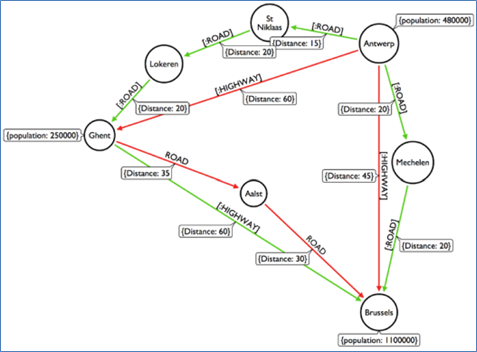
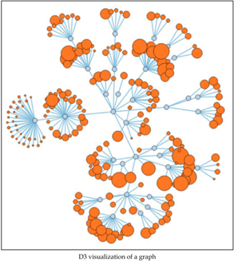
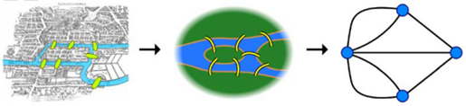
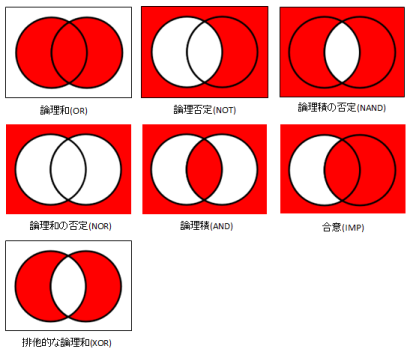

# Neo4j 概要
- Neo4j(ネオフォージェイ)とは、オープンソースNoSQL型グラフデータベースです。
- いくつかの基本的なデータ構造を理解し、SQLライク言語(Cypher)を覚えれば、グラフ理論に基づいたデータ処理機能を利用できます。

# 「グラフデータベース」とは
- グラフデータベースとは、「ノード」「リレーション」「プロパティ」の3要素を持つ
- それらの要素によってノード間の「関係性を表現」する

- データセット全体をひとつの巨大高密度ネットワーク構造としてモデル化します。
- RDBMSには不向きとされる、複雑なデータ群に対する保存/探索/集計に最適化されたデータベースです。
- グラフデータベースは、グラフ化するためだけのデータベースではなく、グラフ理論を使用してデータ処理を行う汎用性の高いデータベースです。グラフ化機能は、多くの機能の中の１つにすぎません。
- グラフ型データベースの設計には、「データモデリング用ER図」「オブジェクトモデル用UML」との共通点もあり、RDBMS設計者でも入りやすい側面を持っています。

# 基本説明
- Neo4jは、グラフデータベースであり、NoSQLデータベースに分類されます。
- Javaで開発されたソフトウェアで、Linux/Windows/Macに対応しています。

# ポイント
- 洗練されたユーザインターフェース（UI）
- データモデリングの容易さ
- 読みやすいクエリ
- 活発なコミュニティ活動
- オプショナルスキーマ

# グラフ理論
下記URLより
https://www.creationline.com/lab/7168

## グラフとは
- 「二つ以上の数量や関数の関係を図形に示したもの」と定義
- 最も身近なものとしては、経路を探るためのグラフがあります。次の図のようなグラフは、始点から終点までの経路が、何種類あるのか、最短経路はどれか、最も低コストの経路はどれかなどを探ることができます。もちろん、このほかにも様々なタイプのグラフがあります。

- 次の図は、花火の現代アートに見えるかも知れませんが、グラフ表現の一つです。

## グラフ理論の起源
グラフ理論の起源には実に面白いエピソードがあります。グラフ理論は18世紀、プロイセン王国の首都にある「ケーニヒスベルク」という町(現ロシア連邦カリーニングラード)から始まったそうです。その町には、プレーゲルという川があり、そこには7つの橋が架けられていたそうです。そして、いつの間かに、その橋のある時点から歩き始め、この7つの橋を2度渡ることなく、全て1度ずつ通って元に戻ってくる経路は存在するのかどうか、という話題が盛り上がったそうです。おそらく、多くの人が自分で歩いてみたり、描いてみたりしたに違いありません。

そこで、1736年。オイラーという学者が表れ、左側の現実世界を右側の点と線、つまり、グラフに置き換えて、いわゆる「ケーニヒスベルクの問題」を解決したそうです。結論をいうと、話題になっていたような幻のルートは存在しないことを証明したらしいです。つまり、議論を続けても、試行錯誤をしてみても、なかなか結論が出なかったある種の問題が、グラフを利用することにより単純明快に解決できたわけです。数学の世界でこの話は、「ケーニヒスベルクの問題」と言って、グラフ理論の起源として知られているらしいです。

## グラフ理論がなぜデータベースエンジンに採用されたのか
お絵描きしかできなさそうなグラフ理論がどうやってデータベースの設計思想として採用されたのでしょうか。簡略に言うと、データベースの王者、リレーショナルデータベースに不向きな複雑な関係性を持ったデータ処理の要求を解決するためでした。次の図のようにリレーショナルデータベースのデータ処理は集合論に準拠していますから、相対的にグラフ理論に比べてデータの複雑さへの対応には限界があります。

コッドさんが、リレーショナルデータベースに関する最初の論文を発表したのが1969年、今日のようなSQLが登場したのが1976年で、Oracle が登場したのか1983年ですが、この数十年はデータベースにおいても大変動の時代でした。社会全体にコンピューターが普及し、そのコンピューター同士がネットワークで繋がり、インターネットが登場しました。そのなかで、データベースはかつて経験したことのない新たな局面を迎えます。それは「暴走するデータの量の問題と、どんどん複雑になっていくデータの関係性の問題」でした。
関係性問題を満たすために生まれたデータベースがグラフデータベース