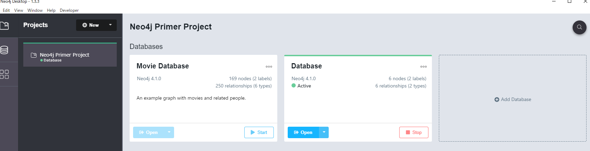

# 環境構築
## インストール
公式サイトからダウンロードし、インストール
https://neo4j.com/download/?ref=product

## 立ち上げ
1. Neo4j Desktopを立ち上げる
2. `Add Database`で任意のデータベースを作成する
3. `Start`でデータベースを開始する
4. `Open`でセッションを呼び出す
    
    
    - `Movie Database`は最初から入っているサンプル
    - 画面右のAdd DatabaseでDBを作成する

