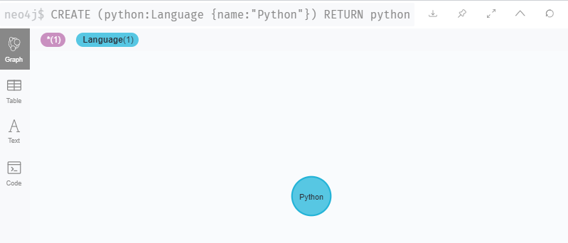
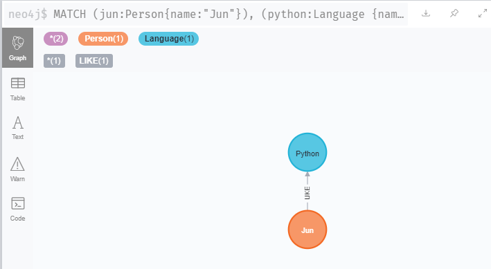
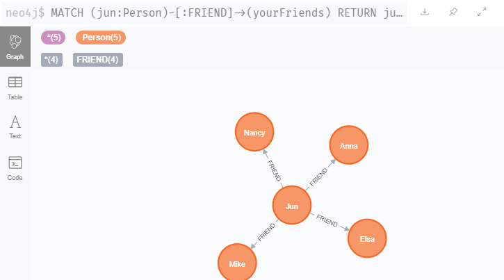
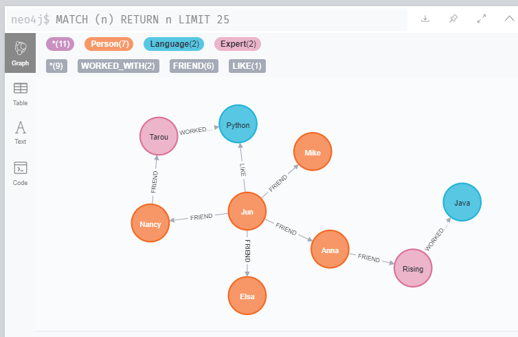
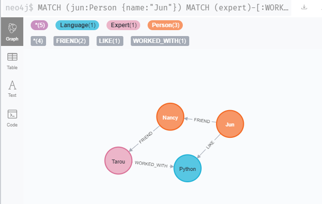

# 操作
| コマンド | 内容                                                 |
| -------- | ---------------------------------------------------- |
| CREATE   | 「ノード」「リレーション」「プロパティ」を生成する。 |
| MATCH    | 条件を満たすデータを取り出す                         |
| RETURN   | 結果を出力する                                       |
| FOREACH  | 特殊命令：FOR文                                      |


- 全件削除
    ```sh
    MATCH (n)
    DETACH DELETE n
    ```

- 全件（「ノード」「リレーション」「プロパティ」）表示
    ```sh
    MATCH (n) RETURN n LIMIT 25
    ```
   
- データの記述
    - `(識別子:ラベル {プロパティ})`
    - `()`と`:`で識別子とラベルを設定
    - `{}`でプロパティを設定。プロパティは`Key:Value`形式


# 本稿の例でやること
1. データの投入
2. 関係性の探索


# Neo4j操作例
### 1.  Junという名前（プロパティ）を持ったPersonを作る
```sh
CREATE (jun:Person{name:"Jun"})
RETURN jun
```


### 2.  Pythonという名前（プロパティ）を持ったLanguageを作る
```sh
CREATE (python:Language {name:"Python"})
RETURN python
```


### 3. jun と python を取り出して、likeの関係性を作る
```sh
MATCH (jun:Person{name:"Jun"}), (python:Language {name:"Python"})
CREATE (jun)-[like:LIKE]->(python)
RETURN jun,like,python
```


### 4. jun と FRIENDSの関係性を持つ4人"Mike", "Nancy", "Anna", "Elsa"を作る
- FOREACHで4人の名前をループさせる。名前は変数nameに入る
- FORループの中にパイプ`|`でつないだ、FRIENDSの関係性をCREATEする
```sh
MATCH (jun:Person {name:"Jun"})
FOREACH (name in ["Mike", "Nancy", "Anna", "Elsa"] | CREATE (jun)-[:FRIEND]->(:Person {name:name}))
```

### 5. jun とFRIENDの関係性をもっているものをyourFRIENDSという変数に入れて、表示
```sh
MATCH (jun:Person)-[:FRIEND]->(yourFriends)
RETURN jun, yourFriends
```



### 6. nanacyとFRIENDのTarouを作る
- TarouはNancyとFRIENDSの関係である
- TarouはPythonでWORKED_WITHの関係である
- TarouはPersonであり、Expertのラベルを持つ

```sh
MATCH (python:Language {name:"Python"})
MATCH (nancy:Person {name:"Nancy"})
CREATE (nancy)-[:FRIEND]->(:Person:Expert {name:"Tarou"})-[:WORKED_WITH]->(python)
```


### 7 javaという言語と、AnnaとFRIENDのRisingを作る
- Java言語を作成する
    ```sh
    CREATE (java:Language {name:"Java"})
    ```
- RisingはAnnaとFRIENDSの関係である
- RisingはJavaでWORKED_WITHの関係である
- RisingはPersonであり、Expertのラベルを持つ
    ```sh
    MATCH (java:Language {name:"Java"})
    MATCH (anna:Person {name:"Anna"})
    CREATE (anna)-[:FRIEND]->(:Person:Expert {name:"Rising"})-[:WORKED_WITH]->(java)
    ```

- 可視化
    ```sh
    MATCH (n) RETURN n LIMIT 25
    ```




### 8. junからPythonのExertのPersonへの最短経路を探す

- Junを取り出し、PythonのExpertを取り出し、expertまでの`shortestPath`を探す
    ```sh
    MATCH (jun:Person {name:"Jun"})
    MATCH (expert)-[:WORKED_WITH]->(python:Language {name:"Python"})
    MATCH path = shortestPath( (jun)-[:FRIEND*..5] - (expert) )
    RETURN python,expert,path
    ```
