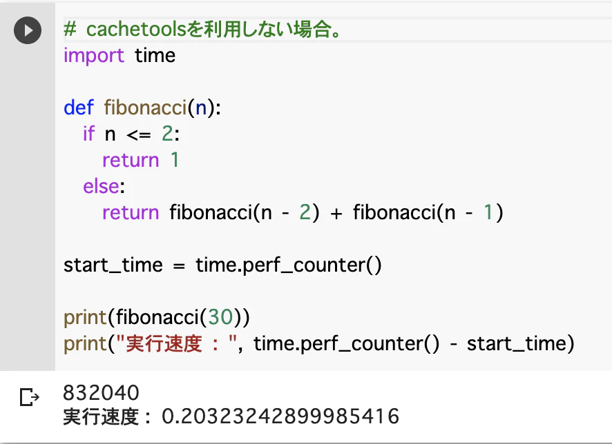
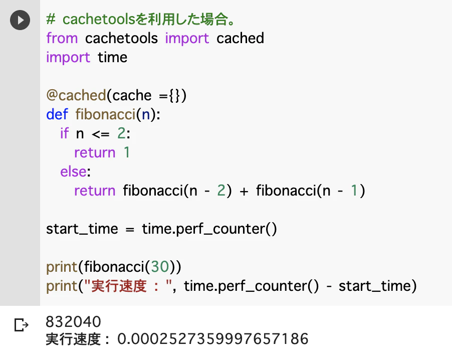

# データキャッシュ
- データベースではないが、データを一時的にキャッシュとして保存し使いまわす方法がある

## 方法①　ファイル書き出し
- ストレージなどにファイルとして書き出す方法
- ファイル書き出しなので、キャッシュ生存期間のコントロールなどは当然できない
- ファイル書き出しなので、プログラム実行後でも呼び出すことが可能


## 方法② cachetools の使用
- ライブラリ `cachetools`を使用する
- 内部キャッシュのため、プログラム実行中のみ使用可能
- 速度が早く、さまざまなキャッシュ利用のためのオプションがある

# cachetools

## 概要
- cachetoolsとは、キャッシュを利用した高速化処理(メモ化)をまとめたコレクションライブラリ。
- 特徴
  - 少ない記述で、多くのキャッシュアルゴリズムを扱うことができる。
  - 拡張可能で、用途や環境に合わせて適切な仕組みへ変更することが可能。
  - データはRAMに保存される。
- Github : [cachetools](https://github.com/tkem/cachetools/)

## 結果
- 以下の2枚の比較画像のように、少ない記述で容易に重たい処理を高速化することが可能。






## インストール
- 以下のコマンドで、cachetoolsライブラリをインストールする。

```bash
pip install cachetools
```

## 記述例


**※この内容では、概要や結果イメージ・基本記述を扱うため、詳細内容は[ドキュメント](https://cachetools.readthedocs.io/en/stable/)を参考。**

### 基本

1. `cachetools` の `cached` をインポートする
1. キャッシュを処理する関数を実装する
1. return にはキャッシュしたいデータが入るようにする
1. 関数に対しデコレータで `@cached` をつける
1. 関数を呼び出すとキャッシュが呼び出される
    * 値がキャッシュされてなければ関数が実行され、値がキャッシュされていれば関数の実行無しで値だけが取得される


#### 標準(オプション指定無し)のキャッシュ処理を利用する場合。

```python
# ライブラリの読み込み
from cachetools import cached

# キャッシュ有効化
@cached(cache ={})
def fibonacci(n):
  if n <= 2:
    return 1
  else:
    return fibonacci(n - 2) + fibonacci(n - 1)

print(fibonacci(30))
```

### 各オプション
- 以下利用できるキャッシュ処理の種類は下記。

|     名前     |                                                            内容                                                            |
| :----------: | :------------------------------------------------------------------------------------------------------------------------: |
| **TTLCache** | キャッシュの存続可能時間指定。<br>存続可能時間を超えたものにはアクセス不可。<br>最も使用頻度の低いアイテムから破棄される。 |
| **LFUCache** |                      最小使用頻度。アイテム取得頻度を計測して、最も頻繁に使用されていないものから破棄                      |
| **LRUCache** |                                    最長未使用頻度。最も長く使用されていないものから破棄                                    |
| **RRCache**  |                                    ランダム。アイテムをランダムに選択して、そこから破棄                                    |

- 以下、記述例

```python
# ライブラリの読み込み
from cachetools import cached, LFUCache, TTLCache, RRCache

@cached(cache=LFUCache(maxsize=10))  # 最大保持数
def get_all_item:
  # 処理

@cached(cache=TTLCache(maxsize=10, ttl=300))  # 最大保持数と存続可能時間
def get_user_item:
  # 処理

@cached(cache=RRCache(maxsize=10, choice=min))  # 最大保持数と任意の要素を返す代替関数
def get_random:
  # 処理。cache.choiceで指定関数(min)の呼び出し可能。
```

## 参考
- [Github](https://github.com/tkem/cachetools)
- [ドキュメント](https://cachetools.readthedocs.io/en/stable/)
- [Cachetools module in Python](https://www.geeksforgeeks.org/cachetools-module-in-python/)