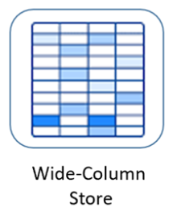

# データベース紹介
## RDB リレーショナルデータベース

- 本稿で取り上げるもの
    - SQLite、MySQL、PostgreSQL
    - Pythonを使用したデータベース操作方法
    - ORM（ObjectRelationMapper）を利用したデータベース操作方法

 

___

## NoSQL

### Key-Value型

一意なキーと、キーに1対1で対応するバリューのペアで、データを保持する方式

- 本稿で取り上げるもの
    - DBM
    - memcach
    - redis

### Document型

キーバリュー型のバリュー部分が、JSONやXMLなどの半構造化データ（ドキュメント）になったような構造

- 本稿で取り上げるもの
    - MongoDB

### Wide-Column

- RDBに似ているが、行ごとにカラムの数や名前が自由
- 本稿では取りあげない。（環境構築が大変なため）
- CassandraやHBaseなど

### グラフ型

データの関係性を操作管理するデータベースで、ノード、エッジ、およびデータプロパティで定義される

- 本稿で取り上げるもの
    - Neo4J

