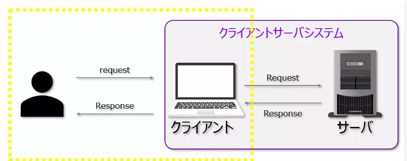
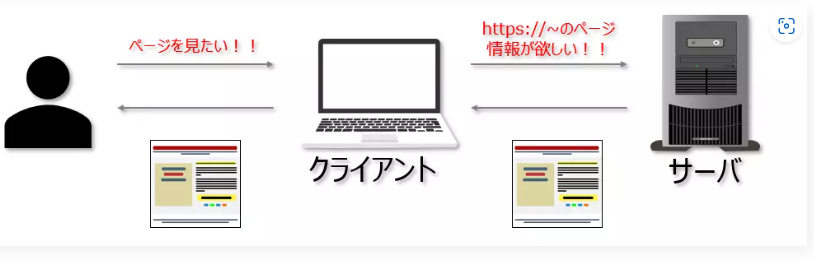
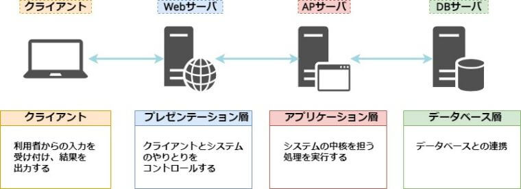

# クライアント・サーバシステム
- クライアントとサーバがそれぞれ別のシステムとして構築されて、相互にデータをやり取りすることでサービスを実現する仕組み
- Webとは上記を `インターネット` で実施する仕組みとなる
    

  
- Webサイトの閲覧なんかはこの仕組み
    

# 3層アーキテクチャ

- サーバシステム部分の役割を更に明確化していく考え方

## プレゼンテーション層
- ユーザのWebブラウザ上に画面(静的コンテンツ)を表示させるための層
- Webブラウザ(safariやGoogle Chromeなど)とWebサーバが役割を担う
- Webサーバはブラウザからの閲覧要求(リクエスト)をもとにページ情報を返す
- また，必要に応じてアプリケーション層に動的な処理を要求する．

#### 実装方法
- HTML、CSS、JavaScript

## アプリケーション層
- Webシステムの動的処理を行う、アプリケーションの中核となる層
- アプリケーションサーバが役割を担う。
- プレゼンテーション層から受け渡された情報をもとに，命令実行や表示画面の作成などの何らかの処理を行う

#### 実装方法
- Java，Ruby，PHP，Python など

## データ層
- アプリケーションによって処理された情報を保管/管理する層
- データベースサーバが役割を担う
- アプリケーション層の処理内容に応じて，データ処理や管理を行う．

#### 実装方法
- MySQL、Oracle、PosrgreSQL、RedisのDB管理ソフトウェア

## この構成のメリット・デメリット
### メリット
1. 負荷分散
    - 集中処理システムでは、１つの汎用機（メインフレーム）に大きな負荷がかかる
    - 分離することで、負荷を分散することができるようになる

2. 部分的な故障に強い
    - クライアントPCが壊れたとしても、サーバには影響しない。APが壊れてもDBに影響しない
    - 障害時の問題特定も素早くできる
        - 別のクライアントPCで正常動作ならクライアント側の問題
        - 別のクライアントPCでも同じ異常ならサーバ側の問題

3. 柔軟なシステム変更に強い
    - 変更すべき箇所が明確化されるため、変更がやりやすい

4. サーバレス構成しやすい
    - それぞれの役割が明確化しているため、そのためのサーバレス構成が取りやすい

### デメリット
- オンプレやIaaSベースのクラウドサービスを使用すると、複数台のサーバが必要となり結果、費用がかかる