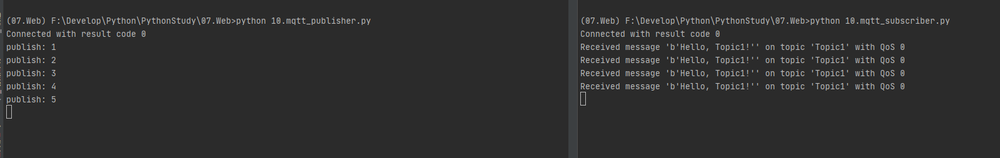
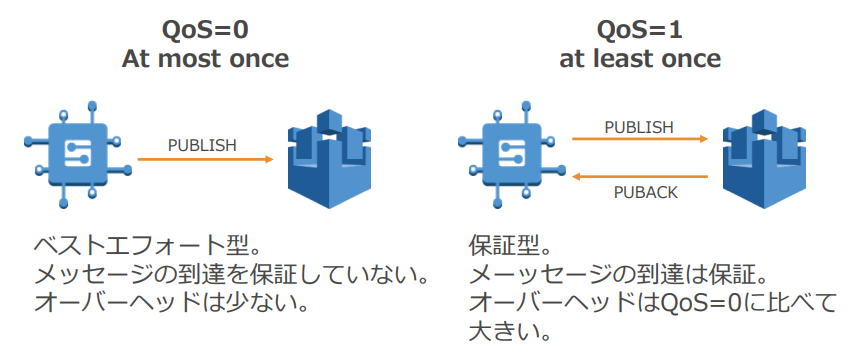
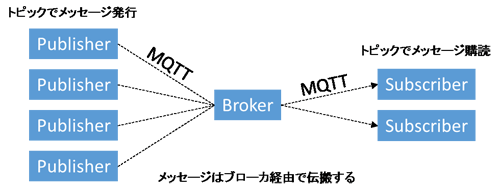

# MQTT

## MQTTブローカー mosquittoのインストール
1. 公式サイトからダウンロード＆インストール
  https://mosquitto.org/download/
2. 必要に応じて、インストールフォルダに対してPATHを通す
3. 下記コマンドでサーバーを起動する。デフォルトはポート1883
    ```sh
    $ mosquitto -v
    ```
    `-v` パラメーターでverboseモード
    
## Python MQTT Clientのインストール
```sh
$ pip install paho-mqtt
```
    
    
# 動作概要
- Publisher　:　データ登録側
    - topic名：【Topic1】に "Hello, Topic1!"というメッセージを送信する

- Subscriber　：　データ取得側
    - topic名：【Topic1】のメッセージを受け取る


## Publisher
1. ブローカーに接続できたときの処理の定義（コールバック登録）
2. ブローカーが切断したときの処理の定義（コールバック登録）
3. publishが完了したときの処理の定義（コールバック登録）
4. データのpublish

```python
import paho.mqtt.client as mqtt
from time import sleep


# 1. ブローカーに接続できたときの処理
def on_connect(client, userdata, flag, rc):
    print("Connected with result code " + str(rc))


# 2. ブローカーが切断したときの処理
def on_disconnect(client, userdata, flag, rc):
    if rc != 0:
        print("Unexpected disconnection.")


# 3. publishが完了したときの処理
def on_publish(client, userdata, mid):
    print(f"publish: {mid}")


# メイン関数   この関数は末尾のif文から呼び出される
def main():
    # クラスのインスタンス(実体)の作成
    client = mqtt.Client() 
    
    # 1. 接続時のコールバック関数を登録
    client.on_connect = on_connect  
    # 2. 切断時のコールバックを登録
    client.on_disconnect = on_disconnect  
     # 3. メッセージ送信時のコールバック
    client.on_publish = on_publish 

    client.connect("localhost", 1883, 60)  # 接続先は自分自身

    # 通信処理スタート
    client.loop_start()  # subはloop_forever()だが，pubはloop_start()で起動だけさせる

    # 永久に繰り返す
    while True:
        # 4. データのpublish
        client.publish("Topic1", "Hello, Topic1!")
        sleep(3)  # 3秒待つ


if __name__ == '__main__':  # importされないときだけmain()を呼ぶ
    main()  # メイン関数を呼び出す
```


## Subscriber
1. ブローカーに接続できたときの処理の定義（コールバック登録）
2. ブローカーが切断したときの処理の定義（コールバック登録）
3. メッセージが届いたときの処理の定義（コールバック登録）

```python
import paho.mqtt.client as mqtt


# ブローカーに接続できたときの処理
def on_connect(client, userdata, flag, rc):
    print("Connected with result code " + str(rc))
    
    # subするトピックを設定
    client.subscribe("Topic1")  


# ブローカーが切断したときの処理
def on_disconnect(client, userdata, flag, rc):
    if rc != 0:
        print("Unexpected disconnection.")


# メッセージが届いたときの処理
def on_message(client, userdata, msg):
    # msg.topicにトピック名が，msg.payloadに届いたデータ本体が入っている
    print("Received message '" + str(msg.payload) + "' on topic '" + msg.topic + "' with QoS " + str(msg.qos))


# MQTTの接続設定
client = mqtt.Client()  # クラスのインスタンス(実体)の作成
client.on_connect = on_connect  # 接続時のコールバック関数を登録
client.on_disconnect = on_disconnect  # 切断時のコールバックを登録
client.on_message = on_message  # メッセージ到着時のコールバック

client.connect("localhost", 1883, 60)  # 接続先は自分自身

client.loop_forever()  # 永久ループして待ち続ける
```


## 結果



___

# [補足]MQTT

## MQTTプロトコルとは

- M2M/IoTで利用されるコミュニケーションプロトコル
- OASIS スタンダードプロトコル(v3.1.1)
- ライトウェイト
- Pub-Sub メッセージ交換モデル
- リソースや回線帯域が限られているデバイスで利用

## メッセージブローカー（MQTT）での注意点
- QoS2には非対応
    - QoS1 :At least Once
    - QoS2 :Exactly Once
    
- Persistent Session(clean session=0)は非対応
    - セッションの保持
    - 対応したっぽい。　
    - [MQTT 永続的セッション](https://docs.aws.amazon.com/ja_jp/iot/latest/developerguide/mqtt-persistent-sessions.html)
- retainには非対応
    - Retain: Topicごとに最後にPublishされたメッセージをMQTTサーバが保持しておく機能。
- 複数のデバイスから同じクライアントIDで接続できない
- メッセージの順序性は保障していない

## MQTT vs HTTPS
- スループットが93倍あがる
- メッセージ送信において1/12の消費電力
- メッセージ受信において1/180の消費電力
- コネクション維持において1/2の消費電力
- ネットワークオーバーヘッドの8倍削減

## MQTT Publish/Subscribeモデル


