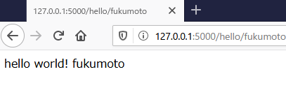

# 01.Webサーバの立ち上げ

## Webサーバの立ち上げ
- URLにアクセスしたら`hello world`を表示するWebサーバを建てる
- Flaskはデコレータ（@app.route）でURLパスを設定し、定義した関数を動作させる

    ```python
    from flask import Flask

    # GlobalにFlaskを用意する
    app = Flask(__name__)


    # Webページの最初　'/'に来たときに、この関数を返す
    @app.route('/')
    def hello_world():
        return 'hello world'


    # app.run()これだけでサーバが走る
    def main():
        app.debug = True
        app.run()
        # app.run(host='127.0.0.1', port=5000)
        
    if __name__ == '__main__':
    main()
    ```
    
- 実行結果
    ```sh
     * Serving Flask app "main" (lazy loading)
     * Environment: production
       WARNING: This is a development server. Do not use it in a production deployment.
       Use a production WSGI server instead.
     * Debug mode: on
     * Restarting with stat
     * Debugger is active!
     * Debugger PIN: 233-206-648
     * Running on http://127.0.0.1:5000/ (Press CTRL+C to quit)
    ```
    
    
    
## パス（処理を追加する）
- トップ(/)は`top`と表示する
- /helloには`hello world`と表示する

    ```python
    from flask import Flask

    # GlobalにFlaskを用意する
    app = Flask(__name__)


    @app.route('/')
    def hello_world():
        return 'top'


    @app.route('/hello')
    def hello_world2():
        return 'hello world!'


    # app.run()これだけでサーバが走る
    def main():
        app.debug = True
        app.run()
        # app.run(host='127.0.0.1', port=5000)


    if __name__ == '__main__':
        main()
    ```

- 実行結果

   
    
   
    
    
 
 ## URLの文字列をプログラム側で受け取る
 - URLの  /hello/`<username>` の`<username>`;は任意で受け付ける
 - usernameをWebサイト上に表示する
    
````python
from flask import Flask

# GlobalにFlaskを用意する
app = Flask(__name__)


@app.route('/')
def hello_world():
    return 'top'


# 任意で入れる文字列を受け取る。デフォルトも入れられる
@app.route('/hello')
@app.route('/hello/<username>')
def hello_world2(username=None):
    if username:
        return f'hello world! {username}'
    else:
        return 'hello'


# app.run()これだけでサーバが走る
def main():
    app.debug = True
    app.run()
    # app.run(host='127.0.0.1', port=5000)


if __name__ == '__main__':
    main()
````

- 実行結果
 
    
    
    