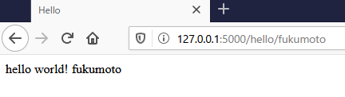

# 02.テンプレート
- Webページは実際はHTMLとCSSで構成される
- そのため、実際はFlaskの動作と、HTMLを連携させる必要がある
- HTML側にFlaskの関数を記述していく形となる


## 準備
- `./templates`ディレクトリを作成し、`hello.html`を作成しておく


## HTML化
- 下記の関数部分をHTMLで記述する

```python
# 任意で入れる文字列を受け取る。デフォルトも入れられる
@app.route('/hello')
@app.route('/hello/<username>')
def hello_world2(username=None):
    if username:
        return f'hello world! {username}'
    else:
        return 'hello'
```

- {\% if \%} ～ {\% endif \%} までがIF文の記述
- 他にも{\% for i in num \%} ～ {\% endfor \%} などもある
- DjangoやJinjaなどの別のフレームワークも同じような記述方法

```html:hello.html
<!DOCTYPE html>
<html lang="en">
<head>
    <meta charset="UTF-8">
    <title>Hello</title>
</head>
<body>



hello world! {{username}}

hello

    
</body>
</html>
```

## Pythonコード側の変更
- `render_template`でhtmlファイルを呼び出す
- `render_template`はimport必要
 
```python
from flask import Flask

# 追加する
from flask import render_template

# GlobalにFlaskを用意する
app = Flask(__name__)

@app.route('/')
def hello_world():
    return 'top'


# render_templateでtemplatesディレクトリのhtmlファイルを返す
@app.route('/hello')
@app.route('/hello/<username>')
def hello_world2(username=None):
    return render_template('/hello.html', username=username)


def main():
    app.debug = True
    app.run()
    # app.run(host='127.0.0.1', port=5000)


if __name__ == '__main__':
    main()
```

- 実行結果




## 参考
- この辺のサイト
  https://tanuhack.com/jinja2-cheetsheet/
  
- [Flask templatesでGoogle検索](https://www.google.com/search?rlz=1C1QABZ_jaJP898JP898&sxsrf=ALeKk007kgixaGbOYbT04EOneemUjyy_7Q%3A1597485670083&ei=ZrI3X73HBM_7wAO04aP4AQ&q=flask+template+&oq=flask+template+&gs_lcp=CgZwc3ktYWIQAzIECCMQJzICCAAyAggAMgIIADICCAAyAggAMgIIADICCABQ7xRY7xRgyxZoAHAAeACAAWeIAWeSAQMwLjGYAQCgAQGqAQdnd3Mtd2l6wAEB&sclient=psy-ab&ved=0ahUKEwi9kpjv-ZzrAhXPPXAKHbTwCB8Q4dUDCAw&uact=5)