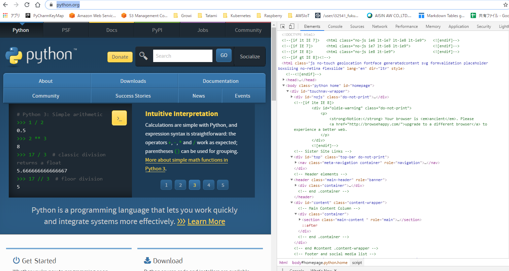

# BeautifulSoup
## BeautifulSoupとは
- Webスクレイピングのためのライブラリ
- HTMLやXMLのデータをパースし、狙ったデータを取得するためのもの
- `reuqests`や`urllib.request`でデータを取得して、`BeautifulSoup`でパースする
- [公式サイト](http://kondou.com/BS4/)


## ここでやること
1. https://www.python.org/ を解読する
2. 　`<title></title>`の情報を取り出す
3. 　`<div class="introduction">`の情報を取り出す




### 1. データの取得

- requetst.getで取得する。
```python
from bs4 import BeautifulSoup
import requests

# 1. requests.getでデータの取得
html = requests.get('https://www.python.org')
print(html.text)
```
   
   
- 結果
```html
<!doctype html>
<!--[if lt IE 7]>   <html class="no-js ie6 lt-ie7 lt-ie8 lt-ie9">   <![endif]-->
<!--[if IE 7]>      <html class="no-js ie7 lt-ie8 lt-ie9">          <![endif]-->
<!--[if IE 8]>      <html class="no-js ie8 lt-ie9">                 <![endif]-->
<!--[if gt IE 8]><!--><html class="no-js" lang="en" dir="ltr">  <!--<![endif]-->

<head>
    <meta charset="utf-8">
    <meta http-equiv="X-UA-Compatible" content="IE=edge">

    <link rel="prefetch" href="//ajax.googleapis.com/ajax/libs/jquery/1.8.2/jquery.min.js">

    <meta name="application-name" content="Python.org">
    <meta name="msapplication-tooltip" content="The official home of the Python Programming Language">
    <meta name="apple-mobile-web-app-title" content="Python.org">
    <meta name="apple-mobile-web-app-capable" content="yes">
    <meta name="apple-mobile-web-app-status-bar-style" content="black">

~~ 略 ~~
```
    
    
    
### 2. BeautifulSoupでパースする

- `BeautifulSoup(html.text, features="html.parser")`
- resquest.getのtextをhtml.parserで処理する


    ```python
    from bs4 import BeautifulSoup
    import requests

    # 1. requests.getでデータの取得
    html = requests.get('https://www.python.org')
    # print(html.text)

    # 2. BeautifulSoupでパースする
    soup = BeautifulSoup(html.text, features="html.parser")
    print(soup)
    ```

- 実行結果
    - requests.getの結果と変わらないが、これでデータの処理ができる状態
    
```html
<!DOCTYPE html>

<!--[if lt IE 7]>   <html class="no-js ie6 lt-ie7 lt-ie8 lt-ie9">   <![endif]-->
<!--[if IE 7]>      <html class="no-js ie7 lt-ie8 lt-ie9">          <![endif]-->
<!--[if IE 8]>      <html class="no-js ie8 lt-ie9">                 <![endif]-->
<!--[if gt IE 8]><!--><html class="no-js" dir="ltr" lang="en"> <!--<![endif]-->
<head>
<meta charset="utf-8"/>
<meta content="IE=edge" http-equiv="X-UA-Compatible"/>
<link href="//ajax.googleapis.com/ajax/libs/jquery/1.8.2/jquery.min.js" rel="prefetch"/>
<meta content="Python.org" name="application-name"/>
<meta content="The official home of the Python Programming Language" name="msapplication-tooltip"/>
<meta content="Python.org" name="apple-mobile-web-app-title"/>
<meta content="yes" name="apple-mobile-web-app-capable"/>
<meta content="black" name="apple-mobile-web-app-status-bar-style"/>
<meta content="width=device-width, initial-scale=1.0" name="viewport"/>
<meta content="True" name="HandheldFriendly"/>
<meta content="telephone=no" name="format-detection"/>
<meta content="on" http-equiv="cleartype"/>
<meta content="false" http-equiv="imagetoolbar"/>
<script src="/static/js/libs/modernizr.js"></script>

    
~~ 略 ==    
```
    
### 3. BeautifulSoupでパースして、titleを取り出す

- `find_all`で任意のタグを取り出す

```python
from bs4 import BeautifulSoup
import requests

# 1. requests.getでデータの取得
html = requests.get('https://www.python.org')

# 2. BeautifulSoupでパースする
soup = BeautifulSoup(html.text, features="html.parser")

# 3. `<title></title>`の情報を取り出す
titles = soup.find_all('title')
print(titles[0].text)
```

- 実行結果
 
```sh
$ Welcome to Python.org
```


### 4. BeautifulSoupでパースして、任意のdivタグを取り出す

- `find_all`で任意のタグを取り出す
```python
from bs4 import BeautifulSoup
import requests

# 1. requests.getでデータの取得
html = requests.get('https://www.python.org')

# 2. BeautifulSoupでパースする
soup = BeautifulSoup(html.text, features="html.parser")

# 3. `<title></title>`の情報を取り出す
# titles = soup.find_all('title')
# print(titles[0].text)

# 4. `<div class="introduction">`の情報を取り出す
intro = soup.find_all('div', {'class': 'introduction'})
print(intro[0].text)
```
- 実行結果

```sh
Python is a programming language that lets you work quickly and integrate systems more effectively. Learn More
```