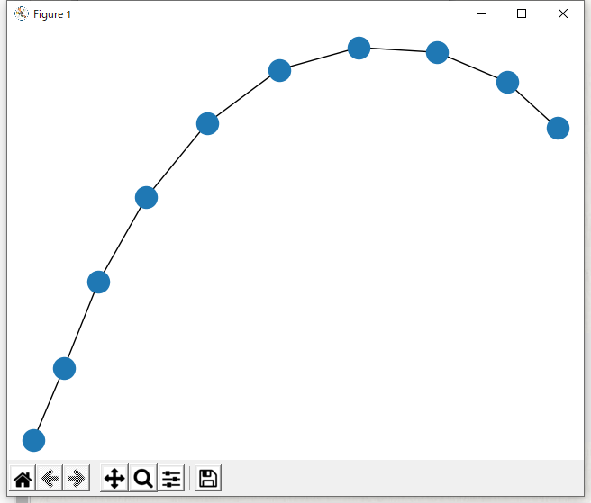
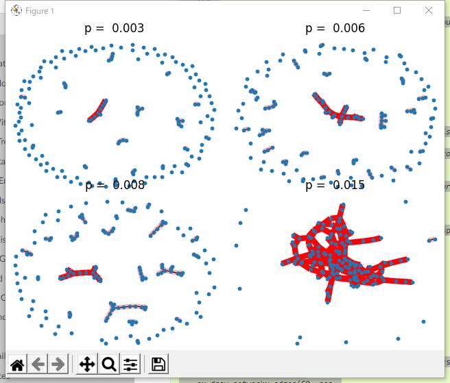

# NetworkX
## NetworkXとは
- Pythonでグラフ・ネットワークを扱うためのライブラリ

## 解説
- [日本語解説サイト](https://docs.pyq.jp/python/math_opt/graph.html)
- [公式サイト](https://networkx.github.io/)
- [公式GitHub](https://networkx.github.io/documentation/stable/index.html)


## Tutorial
https://networkx.github.io/documentation/stable/tutorial.html

### 1. Graphの作成
```python
import networkx as nx
G = nx.Graph()
```


### 2. Nodeの作成
- 単一ノードの作成
```python
G.add_node(1)
```

- 複数ノードの作成
```python
G.add_nodes_from([2, 3])
```

- 描画（matplotlibを使用）
    ```python
    import networkx as nx
    import matplotlib.pyplot as plt

    G = nx.Graph()

    G.add_node(1)
    G.add_nodes_from([2, 3])

    nx.draw(G)
    plt.show()
    ```

    


### 3. Edgeの作成
- エッジの追加
```pyton
# エッジの追加
G.add_edge(1, 2)

# タプルを利用してエッジを追加
e = (2, 3)
G.add_edge(*e)
```

- 複数エッジの追加
```python
G.add_edges_from([(1, 2), (1, 3)])
```


- パスグラフ（一直線）
```python
H = nx.path_graph(10)
G.add_edges_from(H.edges)
```

- 描画
    ```python
    import networkx as nx
    import matplotlib.pyplot as plt

    G = nx.Graph()

    # パスグラフ
    H = nx.path_graph(10)
    G.add_edges_from(H.edges)

    nx.draw(G)
    plt.show()
    ```
    


## 公式Examples
- 下記にたくさんの例があるので、こちらを参照
  https://networkx.github.io/documentation/stable/auto_examples/index.html

- コピペでOK
    https://networkx.github.io/documentation/stable/auto_examples/drawing/plot_giant_component.html#sphx-glr-auto-examples-drawing-plot-giant-component-py

    


## NetworkX - Neo4J
- グラフデータベースであるNeo4Jとの連携は、更に別のライブラリを利用する
- https://github.com/neo4j-graph-analytics/networkx-neo4j

### Usage

Here's how you use it.
First let's import our libraries and create an instance of the Neo4j driver:

```python
from neo4j import GraphDatabase
import nxneo4j as nx

driver = GraphDatabase.driver(uri="bolt://localhost",auth=("neo4j","neo"))
```

For undirected Graphs:
```python
G = nx.Graph(driver)
```

For directed Graphs:
```python
G = nx.DiGraph(driver)
```

The available functions in `nxneo4j` are:
```pytohn
# ADD ONE NODE
G.add_node(node)
node: str, int
>>> G.add_node(1)

# ADD MULTIPLE NODES
G.add_nodes_from(value)
values: list
>>> G.add_nodes_from([1, 2, 3, 4])

# ADD ONE EDGE
G.add_edge(node1,node2)
node1: str, int
node2: str, int
>>> G.add_edge(1,2)

#ADD MULTIPLE EDGES
G.add_edges_from(values)
values: list of tuples
>>> G.add_edges_from([(1, 2),(2, 3),(3, 4)])
```

The available algoritms in `nxneo4j` are:
```python
>>> nx.betweenness_centrality(G)
{3: 4.0, 4: 3.0, 1: 0.0, 2: 0.0, 5: 0.0}

>>> nx.closeness_centrality(G)
{3: 0.8, 4: 0.6666666666666666, 1: 0.5714285714285714, 2: 0.5714285714285714, 5: 0.4444444444444444}

>>> nx.pagerank(G)
{3: 1.4170146573314513, 4: 1.0629939728840803, 1: 0.9591085771210682, 2: 0.9591085771210682, 5: 0.6017724112363687}

>>> nx.triangles(G)
{1: 1, 2: 1, 3: 1, 4: 0, 5: 0}

>>> nx.clustering(G)
{1: 1.0, 2: 1.0, 3: 0.3333333333333333, 4: 0.0, 5: 0.0}

>>> list(nx.community.label_propagation_communities(G))
[{1, 2, 3, 4, 5}]

>>> nx.shortest_path(G, source=1, target=5)
[1, 3, 4, 5]
```
