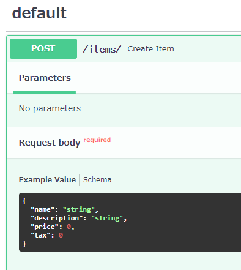

# Request Body


- クライアント(ブラウザなど)からAPIにデータを送信する必要がある場合、リクエストボディとして送信します。
    - リクエストボディとは、クライアントからAPIに送信されるデータのことです。
    - レスポンスボディとは、API がクライアントに送信するデータのことです。
- API側はリクエストボディに応じ必要な処理を行います。（リクエストボディを必要としない場合もある）
- リクエストボディを宣言するには、そのパワーと利点をすべて備えたPydanticモデルを使用します。


## Pydanticを利用したリクエストボディの定義

```python
from typing import Optional

from fastapi import FastAPI
from pydantic import BaseModel
import uvicorn


class Item(BaseModel):
    name: str
    description: Optional[str] = None
    price: float
    tax: Optional[float] = None


app = FastAPI()


@app.post("/items/")
async def create_item(item: Item):
    return item


if __name__ == '__main__':
    uvicorn.run(app=app, port=8080)
```

- `pydantic`で宣言された下記の部分が受け付けるリクエストボディの定義となる（データモデル）
    ```python
    class Item(BaseModel):
        name: str
        description: Optional[str] = None
        price: float
        tax: Optional[float] = None
    ```
    - クエリパラメータをと同様に、デフォルト値がある場合は必須ではありません。それ以外の場合は必須です。None利用可能


- メソッドは`(item: Item)`でリクエストボディを受け付ける




## 送信されたリクエストボディへのアクセス
- 関数の内部では、モデルオブジェクトのすべての属性に直接アクセスすることができます。
```python
from typing import Optional

from fastapi import FastAPI
from pydantic import BaseModel
import uvicorn


class Item(BaseModel):
    name: str
    description: Optional[str] = None
    price: float
    tax: Optional[float] = None


app = FastAPI()


@app.post("/items/")
async def create_item(item: Item):

    # itemのjsonをitem_dictにコピーしておく
    item_dict = item.dict()
    
    # item.xxx で要素にアクセス
    if item.tax:
        price_with_tax = item.price + item.tax
        item_dict.update({"price_with_tax": price_with_tax})
    return item_dict

if __name__ == '__main__':
    uvicorn.run(app=app, port=8080)
```

## まとめ
- Python型宣言だけで、FastAPIは次のようになります。

    - リクエストの本文をJSONとして読み取ります。
    - 対応するタイプを変換します（必要な場合）。
    - データを検証します。
    - データが無効な場合は、間違ったデータがどこに何であったかを正確に示す、明確なエラーが返されます。
    - 受信したデータをパラメータに入力します。
    - 関数でタイプとして宣言したので、Itemすべての属性とそのタイプに対するすべてのエディターサポート（補完など）もあります。
    - モデルのJSONスキーマ定義を生成します。プロジェクトにとって意味がある場合は、他の場所でも使用できます。
    - これらのスキーマは、生成されたOpenAPIスキーマの一部であり、自動ドキュメントUIによって使用されます。


## Request body + path + query parameters
- body、path、およびqueryパラメータをすべて同時に宣言することもできます。
- FastAPIはそれぞれを認識し、正しい場所からデータを取得します。

```python
from typing import Optional

from fastapi import FastAPI
from pydantic import BaseModel
import uvicorn


class Item(BaseModel):
    name: str
    description: Optional[str] = None
    price: float
    tax: Optional[float] = None


app = FastAPI()


@app.put("/items/{item_id}")
async def create_item(item_id: int, item: Item, q: Optional[str] = None):
    result = {"item_id": item_id, **item.dict()}
    if q:
        result.update({"q": q})
    return result


if __name__ == '__main__':
    uvicorn.run(app=app, port=8080)
```

- パラメータがパスで宣言されている場合、それはパスパラメータとして使用されます。
- 関数に（パス以外の）引数がある場合、クエリパラメータとして使用されます
- パラメータがPydanticモデルのタイプであると宣言されている場合、それはリクエストボディとして解釈されます。