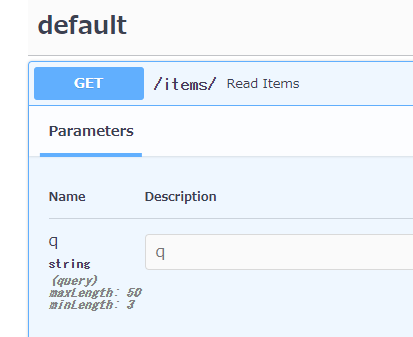

- Pythonの型ヒント、Optionalを利用することで、クエリパラメータの初期値や必須・任意設定することを解説した
- ここではもう少し便利なオプション設定 `Query`を紹介する

# `Query`でできること

- クエリパラメータの文字数の上限、下限数の設定
- クエリパラメータの文字列の正規表現でのチェック
- クエリパラメータを複数まとめて受け付ける
- 他の解説は[公式サイト](https://fastapi.tiangolo.com/tutorial/query-params-str-validations/)参照
 


## 最初に`Query`をインポートする
```python
from typing import Optional

# Queryをインポート
from fastapi import FastAPI, Query
import uvicorn

app = FastAPI()


@app.get("/items/")
async def read_items(q: Optional[str] = None):
    results = {"items": [{"item_id": "Foo"}, {"item_id": "Bar"}]}
    if q:
        results.update({"q": q})
    return results

if __name__ == '__main__':
    uvicorn.run(app=app, port=8080)
```


## 上限文字数、下限文字数を追加する
- 3文字以上、50文字以下の条件を追加する
- `min_length`,`max_length`を追加
```python
from typing import Optional

from fastapi import FastAPI, Query
import uvicorn

app = FastAPI()


@app.get("/items/")
async def read_items(q: Optional[str] = Query(None, min_length=3, max_length=50)):
    results = {"items": [{"item_id": "Foo"}, {"item_id": "Bar"}]}
    if q:
        results.update({"q": q})
    return results


if __name__ == '__main__':
    uvicorn.run(app=app, port=8080)
```



## 正規表現を追加する
- `regex`で入れたい正規表現を追加する

```python
from typing import Optional

from fastapi import FastAPI, Query
import uvicorn

app = FastAPI()


@app.get("/items/")
async def read_items(
        q: Optional[str] = Query(None, min_length=3, max_length=50, regex="^fixedquery$")
):
    results = {"items": [{"item_id": "Foo"}, {"item_id": "Bar"}]}
    if q:
        results.update({"q": q})


if __name__ == '__main__':
    uvicorn.run(app=app, port=8080)
```


## クエリパラメータの同一条件を複数まとめて受け付ける

- クエリパラメータは同じもの(下記の場合q)を複数受け付けることができる
```
http://localhost:8000/items/?q=foo&q=bar
```

- URLに複数回出現する可能性のあるクエリパラメータを宣言するには、次のように`Optional`で`List`を宣言する

```python
# Listをインポート
from typing import Optional, List

from fastapi import FastAPI, Query
import uvicorn

app = FastAPI()


@app.get("/items/")
# qをOptionalでListを追加
async def read_items(q: Optional[List[str]] = Query(None)):
    query_items = {"q": q}
    return query_items


if __name__ == '__main__':
    uvicorn.run(app=app, port=8080)
```

- 配列(で受け付ける形となる)
