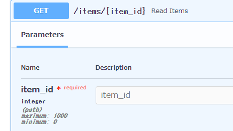
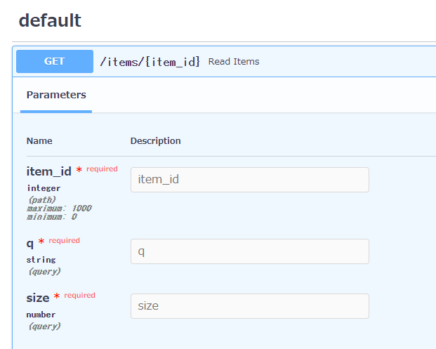

# PathParametersの追加オプション

- QueryParametersと同じ用にPathParametersも追加オプションが可能
- `Path`の解説

## Pathでできること  
- パスパラメータの（数の）上限、下限数の設定
- パスパラメータの（数の）浮動小数点の設定


## Pathのインポート
```python
from fastapi import FastAPI, Query, Path
```


### 以上、以下
- ge, leで以上、以下を設定できる
- `...`は初期値を表すため、必須

```python
from fastapi import FastAPI, Query, Path
import uvicorn

app = FastAPI()


@app.get("/items/{item_id}")
async def read_items(
        q: str,
        item_id: int = Path(..., ge=0, le=1000) ):
    results = {"item_id": item_id}
    if q:
        results.update({"q": q})
    return results


if __name__ == '__main__':
    uvicorn.run(app=app, port=8080)
```

- gt：より大きい
- ge：以上
- lt：より小さい
- le：以下




## 浮動小数点
- floatで宣言し、gt, ltを使う

```python

from fastapi import FastAPI, Query, Path
import uvicorn

app = FastAPI()


@app.get("/items/{item_id}")
async def read_items(
        q: str,
        item_id: int = Path(..., ge=0, le=1000),
        size: float = Query(..., gt=0, lt=10.5)
):
    results = {"item_id": item_id}
    if q:
        results.update({"q": q})
    return results


if __name__ == '__main__':
    uvicorn.run(app=app, port=8080)
```



## 補足：順番の入れ替え
- 記述的に `q`は最上段に記載する必要がある
```python
async def read_items(
        q: str,
        item_id: int = Path(..., ge=0, le=1000),
        size: float = Query(..., gt=0, lt=10.5)
):
```

- `*`を最上段に持ってくることで、順番（`q`の位置）を入れ替えることができる
```PYTHON
from fastapi import FastAPI, Query, Path
import uvicorn

app = FastAPI()


@app.get("/items/{item_id}")
async def read_items(
        *,
        item_id: int = Path(..., title="The ID of the item to get", ge=0, le=1000),
        size: float = Query(..., gt=0, lt=10.5),
        q: str
):
    results = {"item_id": item_id}
    if q:
        results.update({"q": q})
    return results


if __name__ == '__main__':
    uvicorn.run(app=app, port=8080)
```