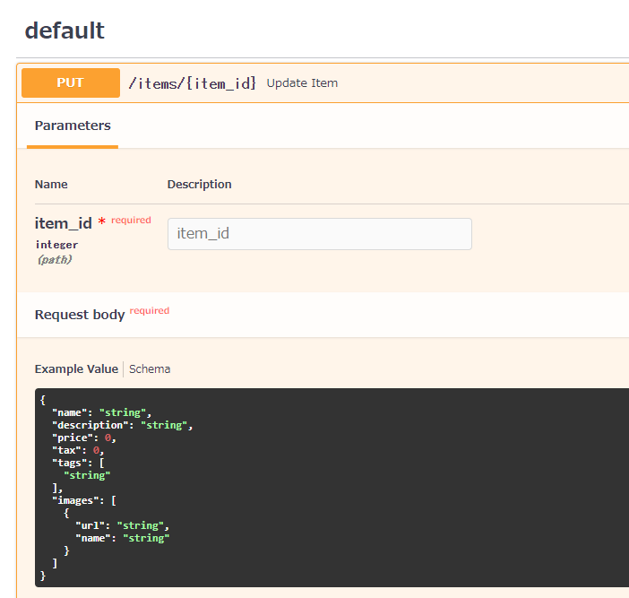

# ネストされたBodyを受け付ける
https://fastapi.tiangolo.com/tutorial/body-nested-models/


## リストを受ける
- この例では、tagsに「文字列のリスト」を入れることができます
```python
from typing import Optional, List

from fastapi import FastAPI
from pydantic import BaseModel
import uvicorn

app = FastAPI()


class Item(BaseModel):
    name: str
    description: Optional[str] = None
    price: float
    tax: Optional[float] = None
    tags: List[str] = []


@app.put("/items/{item_id}")
async def update_item(item_id: int, item: Item):
    results = {"item_id": item_id, "item": item}
    return results


if __name__ == '__main__':
    uvicorn.run(app=app, port=8080)

```


## より深くネストしたJSON構造を受け付ける
- `Item`の中の`image`がさらにJSONでネストしている場合
- `Image`構造を宣言し、`Item`宣言の中で`Image`を呼び出す

```python
from typing import Optional, Set

from fastapi import FastAPI
from pydantic import BaseModel
import uvicorn

app = FastAPI()


class Image(BaseModel):
    url: str
    name: str


class Item(BaseModel):
    name: str
    description: Optional[str] = None
    price: float
    tax: Optional[float] = None
    tags: Set[str] = []
    image: Optional[Image] = None


@app.put("/items/{item_id}")
async def update_item(item_id: int, item: Item):
    results = {"item_id": item_id, "item": item}
    return results


if __name__ == '__main__':
    uvicorn.run(app=app, port=8080)

```


## リスト+JSONの複雑な構成
- Set:set型（集合型）
- HttpUrl:HTTP型（http:、https: の形）

```python
from typing import Optional, Set, List

from fastapi import FastAPI
from pydantic import BaseModel, HttpUrl
import uvicorn

app = FastAPI()


class Image(BaseModel):
    url: HttpUrl
    name: str


class Item(BaseModel):
    name: str
    description: Optional[str] = None
    price: float
    tax: Optional[float] = None

    # set型のリスト（重複した項目は同じものとして扱う）
    tags: Set[str] = []

    # リストの中にImageの構成のJSON
    images: Optional[List[Image]] = None


@app.put("/items/{item_id}")
async def update_item(item_id: int, item: Item):
    results = {"item_id": item_id, "item": item}
    return results


if __name__ == '__main__':
    uvicorn.run(app=app, port=8080)

```

- 下記のようなリクエストボディを期待する
```json
{
    "name": "Foo",
    "description": "The pretender",
    "price": 42.0,
    "tax": 3.2,
    "tags": [
        "rock",
        "metal",
        "bar"
    ],
    "images": [
        {
            "url": "http://example.com/baz.jpg",
            "name": "The Foo live"
        },
        {
            "url": "http://example.com/dave.jpg",
            "name": "The Baz"
        }
    ]
}
```

