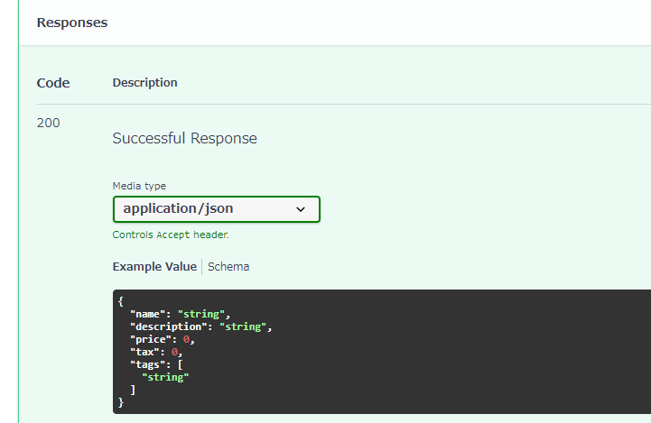
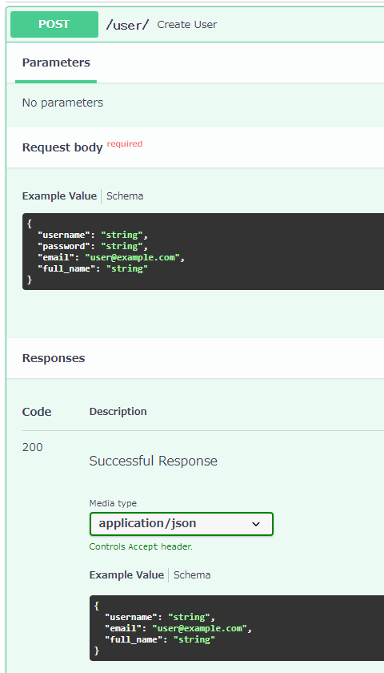

# ResponseModel

- レスポンスボディの定義方法は、リクエストボディと同様にPydanticモデルで定義する
- response_modelをデコレータ内に定義することで、リクエストの形を設定する
    ```python
    @app.get("/path/", response_model=Item)
    @app.post("/path/", response_model=Item)
    @app.put("/path/", response_model=Item)
    @app.delete("/path/", response_model=Item)
    ```

## レスポンスモデルの設定
```python
from typing import Optional, List

from fastapi import FastAPI
from pydantic import BaseModel
import uvicorn

app = FastAPI()


class Item(BaseModel):
    name: str
    description: Optional[str] = None
    price: float
    tax: Optional[float] = None
    tags: List[str] = []


@app.post("/items/", response_model=Item)
async def create_item(item: Item):
    return item


if __name__ == '__main__':
    uvicorn.run(app=app, port=8080)
```



## レスポンスモデルの加工
- 入力されたリクエストモデルを加工して、レスポンスとして出力する
- 下記の場合、入力には`password`があるが、出力には`password`が出力されない

```PYTHON
from typing import Optional

from fastapi import FastAPI
from pydantic import BaseModel, EmailStr
import uvicorn

app = FastAPI()


class UserIn(BaseModel):
    username: str
    password: str
    email: EmailStr
    full_name: Optional[str] = None


class UserOut(BaseModel):
    username: str
    # Out側にはpasswordはない
    email: EmailStr
    full_name: Optional[str] = None


@app.post("/user/", response_model=UserOut)
async def create_user(user: UserIn):
    return user


if __name__ == '__main__':
    uvicorn.run(app=app, port=8080)
```



※ `EmailStr`の利用には↓が必要
```
pip install pydantic[email]
```