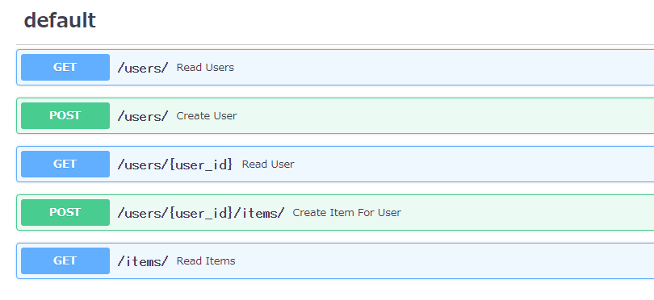

# FastAPIアプリの作成

```python:main.py
from typing import List

from fastapi import Depends, FastAPI, HTTPException
from sqlalchemy.orm import Session
import uvicorn

from sql_app import crud, models, schemas
from sql_app.database import SessionLocal, engine

models.Base.metadata.create_all(bind=engine)

app = FastAPI()


# Dependency
def get_db():
    db = SessionLocal()
    try:
        yield db
    finally:
        db.close()


@app.post("/users/", response_model=schemas.User)
def create_user(user: schemas.UserCreate, db: Session = Depends(get_db)):
    db_user = crud.get_user_by_email(db, email=user.email)
    if db_user:
        raise HTTPException(status_code=400, detail="Email already registered")
    return crud.create_user(db=db, user=user)


@app.get("/users/", response_model=List[schemas.User])
def read_users(skip: int = 0, limit: int = 100, db: Session = Depends(get_db)):
    users = crud.get_users(db, skip=skip, limit=limit)
    return users


@app.get("/users/{user_id}", response_model=schemas.User)
def read_user(user_id: int, db: Session = Depends(get_db)):
    db_user = crud.get_user(db, user_id=user_id)
    if db_user is None:
        raise HTTPException(status_code=404, detail="User not found")
    return db_user


@app.post("/users/{user_id}/items/", response_model=schemas.Item)
def create_item_for_user(
        user_id: int, item: schemas.ItemCreate, db: Session = Depends(get_db)
):
    return crud.create_user_item(db=db, item=item, user_id=user_id)


@app.get("/items/", response_model=List[schemas.Item])
def read_items(skip: int = 0, limit: int = 100, db: Session = Depends(get_db)):
    items = crud.get_items(db, skip=skip, limit=limit)
    return items


if __name__ == '__main__':
    uvicorn.run(app=app, port=8080)
```


## 解説
### 01. データベースの作成
- データベース実態の作成
```python
models.Base.metadata.create_all(bind=engine)
```

### 02. 依存関係の作成
- SessionLocal、sql_app/databases.pyファイルで作成したクラスを使用して、依存関係を作成する。
- SessionLocalリクエストごとに独立したデータベースセッション/接続（）を用意し、
  すべてのリクエストで同じセッションを使用し、リクエストの終了後に閉じる必要があります。


```python
# Dependency
def get_db():
    db = SessionLocal()
    try:
        yield db
    finally:
        db.close()
```

- この依存関係を各処理に追加する
- `Session = Depends(get_db)`で渡す

```python
@app.post("/users/", response_model=schemas.User)
def create_user(user: schemas.UserCreate, db: Session = Depends(get_db)):


@app.get("/users/", response_model=List[schemas.User])
def read_users(skip: int = 0, limit: int = 100, db: Session = Depends(get_db)):


@app.get("/users/{user_id}", response_model=schemas.User)
def read_user(user_id: int, db: Session = Depends(get_db)):


@app.post("/users/{user_id}/items/", response_model=schemas.Item)
def create_item_for_user(


@app.get("/items/", response_model=List[schemas.Item])
def read_items(skip: int = 0, limit: int = 100, db: Session = Depends(get_db)):
```


### 03. 実際の処理
```python
@app.post("/users/", response_model=schemas.User)
def create_user(user: schemas.UserCreate, db: Session = Depends(get_db)):
    db_user = crud.get_user_by_email(db, email=user.email)
    if db_user:
        raise HTTPException(status_code=400, detail="Email already registered")
    return crud.create_user(db=db, user=user)


@app.get("/users/", response_model=List[schemas.User])
def read_users(skip: int = 0, limit: int = 100, db: Session = Depends(get_db)):
    users = crud.get_users(db, skip=skip, limit=limit)
    return users


@app.get("/users/{user_id}", response_model=schemas.User)
def read_user(user_id: int, db: Session = Depends(get_db)):
    db_user = crud.get_user(db, user_id=user_id)
    if db_user is None:
        raise HTTPException(status_code=404, detail="User not found")
    return db_user


@app.post("/users/{user_id}/items/", response_model=schemas.Item)
def create_item_for_user(
    user_id: int, item: schemas.ItemCreate, db: Session = Depends(get_db)
):
    return crud.create_user_item(db=db, item=item, user_id=user_id)


@app.get("/items/", response_model=List[schemas.Item])
def read_items(skip: int = 0, limit: int = 100, db: Session = Depends(get_db)):
    items = crud.get_items(db, skip=skip, limit=limit)
    return items
```


## 実行
```sh
$ python main.py
```
- Swagger
  http://127.0.0.1:8080/docs
  
