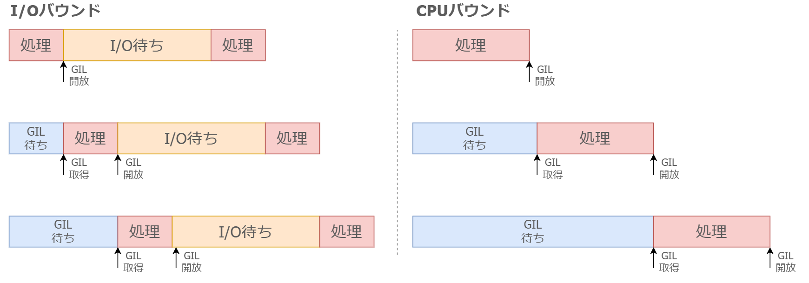

# *マルチスレッド*のI/OバウンドとCPUバウンド

- メリット
    - I/Oバウンドの処理には効果的（I/O待ち中に他の処理ができる）
    - スレッド数がマルチプロセスより増やすことができるので、スケールしやすい
    - メモリを共有するため、データの受け渡しが容易

- デメリット
    - GIL 待ちが発生する
    - CPUバウンドには不向き
    - メモリを共有するため、データアクセス管理が必要

# *マルチプロセス*のI/OバウンドとCPUバウンド

- メリット
    - GILの影響を受けない
    - メモリを共有しないため、データの管理が不要

- デメリット
    - CPUの数を超えて並列化はできないので、スケールが難しい
    - プロセス間通信をしないと、データを受け渡せない