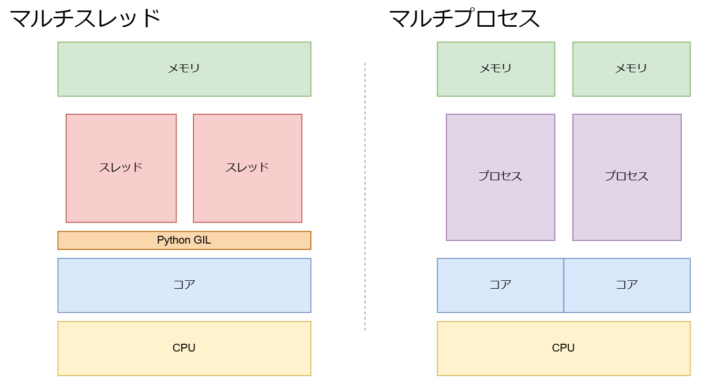

$lsx()

# 並列化関連の用語


## Pythonにおけるマルチスレッド/マルチプロセス



### 処理


- 並行(Concurrent)    
  - Threadeing    
  - タスクが並行に走る（同じタイミングで同時に走っているわけではない）   
  - PythonではGILロックというものがあり、GILロックを取得したタスクが実行される
  - メモリは共有されるため、スレッド間のデータのやり取りは容易だが、管理が必要
  
- 並列(Parallel)  
  - Multiprocess   
  - コアが複数であれば、完全に並列でタスクが走る
  - メモリは共有されないため、スレッド間のデータのやり取りはプロセス間通信が必要


### バウンド
- CPUバウンド    
  - 数値計算
      - ```python
        sum([i+1-2+3 for in range(100000)]))
        ```
    
- I/Oバウンド    
  - ネットワーク通信
  - ファイル書き込み
  - f.read()

### ブロッキング
- ブロッキング
- ノンブロッキング
    - 非同期I/O（Asyncio）

|                  | マルチプロセス | スレッド  | 非同期        |
| ---------------- | -------------- | --------- | ------------- |
| スケール         | 少ない（0-10） | 中（100） | 多い（1000+） |
| I/Oバウンド      | 早い           | 早い      | 早い          |
| CPUバウンド      | 早い           | 早くない  | 早くない      |
| GIL              | ない           | ある      | ない          |
| ブロッキング関数 | ある           | ある      | ない          |


# GILロック


