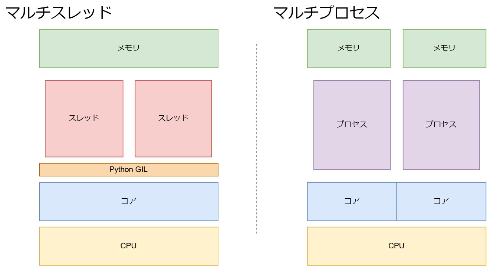

# プロセス間通信

## データのやり取り


- マルチスレッド
  - メモリは共有されるため、スレッド間のデータのやり取りは容易だが、管理が必要
  
- マルチプロセス  
  - メモリは共有されないため、スレッド間のデータのやり取りはプロセス間通信が必要


## マルチプロセスでのプロセス間通信
- Queue
    - [マルチスレッドの章](/TecInfo/00.Python_Programing/09.マルチスレッドとマルチプロセス/01.マルチスレッド/08.キュー)で解説済み
- Pipe
    - あるプロセスの処理結果を別のプロセスに渡すこと。本稿で解説
- Value、Array
    - プロセス間の共有メモリ。Value(値)とArray（配列）。本稿で解説
- Manager
    - プロセス間の共有メモリ。Value、Arrayより扱えるデータ型が多い（辞書型など）。ただしValue、Arrayより遅い


## マルチプロセスでデータが共有されていないことの例

### マルチスレッドでのデータ共有
1. 一方のスレッドをロックし、辞書のデータを変更（＋１する）
2. もう一方のスレッドで辞書のデータを変更（＋１する）

```python:threading.py

import logging
import threading
import time

logging.basicConfig(
    level=logging.DEBUG, format='%(threadName)s: %(message)s')


def worker1(d, lock):
    # 3. workerがlockした状態で
    with lock:
        # 4. 受け取った辞書{x:0}をiにいれて
        i = d['x']
        # 5. sleep 2秒して
        time.sleep(2)
        # 6. 辞書の値に1を足す 0+1 = 1  {'x':1}
        d['x'] = i + 1
        logging.debug(d)


def worker2(d, lock):
    with lock:
        # 7. worker1で{'x':1}になったdを受け付けるので
        i = d['x']
        # 8. 1+1 =2 {'x':2}
        d['x'] = i + 1
        logging.debug(d)


if __name__ == '__main__':
    # 1. 辞書を定義
    d = {'x': 0}

    # 2. Lockを設定
    lock = threading.Lock()
    t1 = threading.Thread(target=worker1, args=(d, lock))
    t2 = threading.Thread(target=worker2, args=(d, lock))
    t1.start()
    t2.start()

    logging.debug(d)
```
```sh:実行結果
MainThread: {'x': 0}
Thread-1: {'x': 1}
Thread-2: {'x': 2}   ★スレッド１の結果を引き継いで＋１している
```


### マルチプロセスでプロセス間通信を意識せず、↑のマルチスレッドの処理をマルチプロセス化する

```python:multiprocess.py
import logging
# import threading
import multiprocessing
import time

# logging.basicConfig(
#     level=logging.DEBUG, format='%(threadName)s: %(message)s')

logging.basicConfig(
    level=logging.DEBUG, format='%(processName)s: %(message)s')


def worker1(d, lock):
    with lock:
        i = d['x']
        time.sleep(2)
        d['x'] = i + 1
        logging.debug(d)


def worker2(d, lock):
    with lock:
        i = d['x']
        d['x'] = i + 1
        logging.debug(d)


if __name__ == '__main__':
    d = {'x': 0}

    # lock = threading.Lock()
    lock = multiprocessing.Lock()
    # t1 = threading.Thread(target=worker1, args=(d, lock))
    t1 = multiprocessing.Process(target=worker1, args=(d, lock))
    # t2 = threading.Thread(target=worker2, args=(d, lock))
    t2 = multiprocessing.Process(target=worker2, args=(d, lock))
    t1.start()
    t2.start()

    logging.debug(d)
```
```sh:実行結果
MainProcess: {'x': 0}
Process-1: {'x': 1}
Process-2: {'x': 1} ★プロセス２はプロセス１の結果を引き継いでいない
```