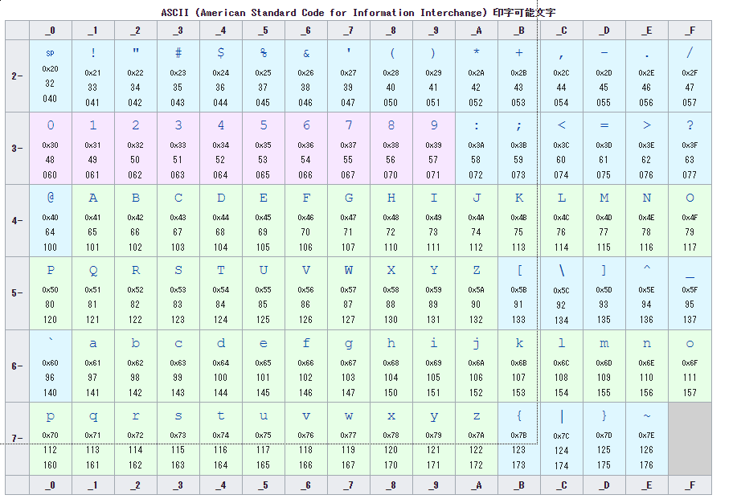
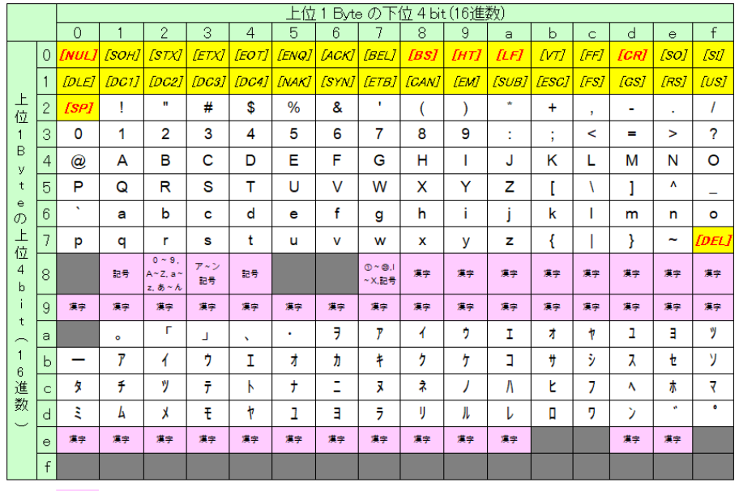
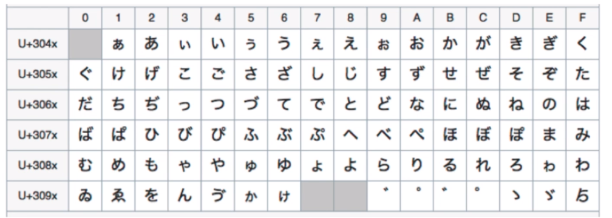
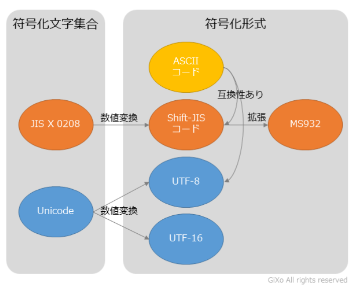
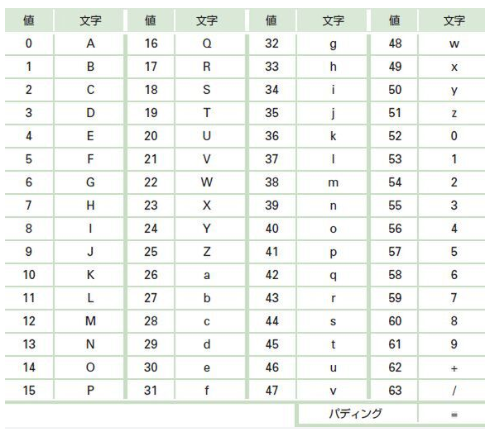
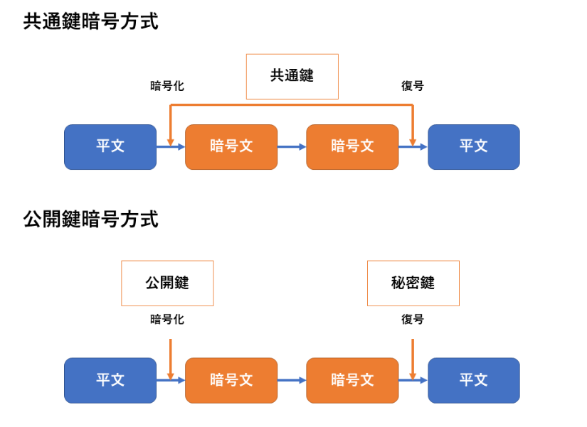
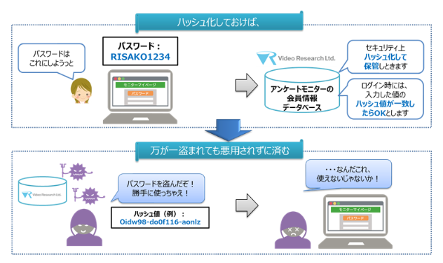

# 文字コード
## ASCII 符号化方式

- 主に`英語圏`で利用される文字コード
- 基本的な文字コード
- 1文字を1バイト



```python
>>> a = 'A'
>>> ord(a)
65
>>> hex(ord(a))
'0x41'
>>> bin(0x41
```


## Shift-JIS 符号化方式
- ASCIIコードに漢字などの日本語を追加した文字コード


```python
>>> a = 'あ'
>>> a.encode('shift-jis')
b'\x82\xa0'
>>> bin(0x82a0)
'0b1000001010100000'
```


## Unicode 符号化文字規格（文字集合規格）

- 世界中の文字を単一の文字集合として扱う符号化文字集合規格（文字コードではない）


```python
>>> a = 'あ'
>>> ord(a)
12354
>>> hex(ord(a))
'0x3042'
>>> bin(0x3042)
'0b11000001000010'
>>>
```

- ファイルの出力するときは圧縮されたりなど、べつの形で保存される

## UTF-8 符号化規格
- Unicodeは世界中の文字のため、対応表を作ると膨大な量（ビット数）になる
- Unicodeを符号化（文字コード化）したものがUTF-8
    - ASCIIコードに世界中の文字を加えたもの
    - 世界中の文字に対応しているため、世界標準の文字コード

```python
>>> a = 'あ'
>>> a.encode()
b'\xe3\x81\x82'
>>> a.encode('utf-8')
b'\xe3\x81\x82'
>>> bin(0xE38182)
'0b111000111000000110000010'
```



## Base64
- データそのものを64種類の印字可能な英数字のみ（それ以外は使用不可）で表した文字コード
- 通信環境でマルチバイト文字、バイナリデータをあつかうためのエンコード方式
- データ変換形式の一つ
    - 添付ファイル　→　Base64変換　→　文字情報
    - 文字情報　　　→　Base64逆変換　→　添付ファイル



```python
>>> import os, base64
>>> base64.b64encode(os.urandom(32))
b'gor/Bv/zGan5Rxo2NBmyIlh4bMFRbPaMHNkHYAwpw5s='
```

# 暗号化・復号

- プログラムで暗号化・復号する場合、下記の技術をすべて利用する必要がある

### 鍵（Key）
- 平文を暗号文にする際に使用するデータのこと。（英語ではkey）
- 鍵のデータを知っている人のみが暗号文を平文に戻すことが出来る
- 基本的に鍵のデータは他人に知られてはいけないもの


## 共通鍵暗号化方式
- 同じ鍵で暗号化と復号を行います

## 公開鍵暗号化方式
- 一対の鍵（公開鍵と秘密鍵）を用い、公開鍵で暗号化、秘密鍵で復号する




### AES
- 公開鍵暗号化方式で採用される暗号化方式
- AES = Advanced Encryption Standard
- （2020年時点）アメリカで標準規格として採用されている暗号化方式
- もとのデータを***128bit(16byte)のデータ***に分割して、（ブロック長）暗号化す


### 暗号利用モード (cipher mode)
- ブロック長（鍵）より長いデータを暗号化するメカニズム（英語では、cipher mode）
- 暗号利用モードは様々な方式がある（ECB、CBCモードなど）
    https://ja.wikipedia.org/wiki/暗号利用モード


### パディング (padding)
- 暗号化をするにあたって、平文のデータ長は***何らかの整数倍長である必要がある***。（暗号化アルゴリズムによる）
    - AESでは128bit(16byte)の整数倍長
- 平文が倍数長になっていない場合に、平文に無駄なデータ（詰め物）を付加することをパディングするという
- パディングデータは復号時には除去される


### 初期ベクトル (IV:Initial Vector)
- 初期ベクトル（IV）はブロック暗号（例：AES）で使用されるランダムまたは疑似ランダムなデータ
- このIVは、同じ平文が同じ暗号文にならないように役立ちます。

#### なぜ必要か？
- 暗号化されたデータがパターンを持っていると、攻撃者はそのパターンを分析して平文の情報を推測する可能性がある
- 例えば、ある文書で「こんにちは」が頻繁に出現する場合、その暗号文も特定のパターンで頻繁に出現する
- IVを使用することで、同じ平文でも異なる暗号文が生成され、攻撃者が推測するのを難しくすることができる

#### 具体例
平文：`"こんにちは、こんにちは"`
鍵（Key）：`"秘密鍵"`

1. **IVなしの場合**  
    - "こんにちは" → 暗号文1
    - "こんにちは" → 暗号文1
    - 最終的な暗号文：暗号文1 + 暗号文1

2. **IVありの場合**
    - IV1 + "こんにちは" → 暗号文2
    - IV2 + "こんにちは" → 暗号文3
    - 最終的な暗号文：暗号文2 + 暗号文3

ここで、IV1とIV2はそれぞれ異なるランダムなデータです。

#### 注意点
- IVは暗号文と一緒に送信することが一般的ですが、IV自体が他人に知られることによるリスクは低いです。重要なのは、IVが予測不可能であることです。
- データを送るたびにIVをかえて送るイメージ
- 同じIVと鍵（Key）の組み合わせを再利用しないように注意する必要があります。

#### 参考
[初期ベクトル - Wikipedia](https://ja.wikipedia.org/wiki/%E5%88%9D%E6%9C%9F%E5%8C%96%E3%83%99%E3%82%AF%E3%83%88%E3%83%AB)

このように、初期ベクトル（IV）は暗号の安全性を高めるために非常に重要な要素となります。


 


# ハッシュ化
- データをハッシュ関数を用いて変換したもの
- ハッシュ値から元データを特定（複合）するのは***事実上不可能***
    - そのため、暗号化とは違う扱いとなる
- 元データが同じなら、生成されるハッシュの値は常に同じ
- 元データが変わると、生成されるハッシュの値はかなり変わる
- パスワードなどをハッシュ化してDBに格納することで、DBに直接アクセスしてもパスワードが推測できない




- (2020年現在)SHA-2というハッシュ関数を用いてハッシュ化することが一般的
- ハッシュ値は長さも決まるため、長さによってバリエーションが有る（長いほど強度）
    - SHA-224 : 224bit
    - SHA-256 : 256bit
    - SHA-384 : 384bit
    - SHA-512 : 512bit
    - SHA-512/224 : 512bitを224bitに分けたもの
    - SHA-512/256 : 512bitを256bitに分けたもの