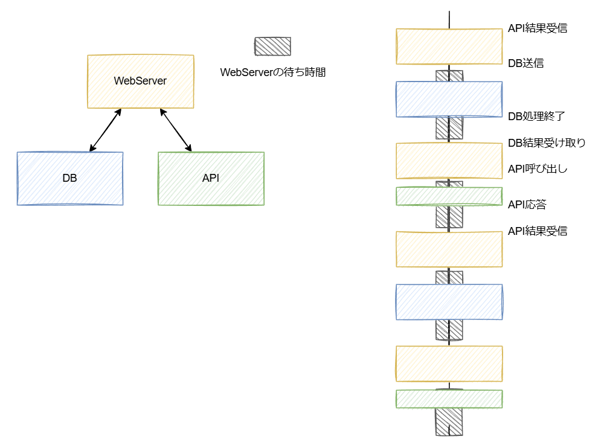
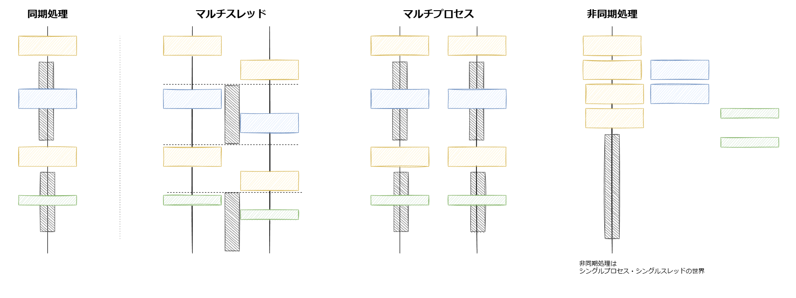

# 非同期処理とは

- 非同期処理は、あるタスクが実行をしている際に、他のタスクが別の処理を実行できる方式
- 同期処理は、あるタスクが実行している間、他のタスクの処理は中断される方式。
- 非同期処理は下記の場合に、少ないリソースで効果的に処理することができる方式
    1. 処理自体はある程度軽いもの
    2. DB、API、メモリなどのI/Oが発生するもの
    3. たくさん同時に処理する必要があるもの 

# 処理の動作例
- WebServer、DB、APIの構成
- WebServerはDBとAPIにリクエストを投げて、処理をすすめるような構成
- 下記の図は同期処理のイメージ

# 処理ごとの待ち時間
- 同期処理
    - すべてのタスクが順番に実行され、一つのタスクが完了するまで次のタスクは開始されない
    - したがって、全体の処理時間はすべてのタスクの処理時間の合計となる
- 非同期処理
    - 各タスクは他のタスクの完了を待たずに開始される
    - その結果、全体の処理時間は最も時間のかかるタスクの処理時間に近い値となります。
- マルチコア
    - 複数のコアが同時に異なるタスクを実行することで、全体の処理時間を短縮する
    - ただし、タスク間の通信や同期に時間がかかることがあある
- マルチスレッド
    - 一つのプロセス内で複数のスレッドが並行して実行さる。
    - しかし、PythonのGIL（Global Interpreter Lock）の影響で、CPU密集型のタスクではマルチコアと同じような効果は得られない

# 処理のイメージ（将棋で考える）
- 藤井聡太 VS 24人の素人

- 非同期処理は処理の途中で***中断・再開***ができることが最大位の特徴