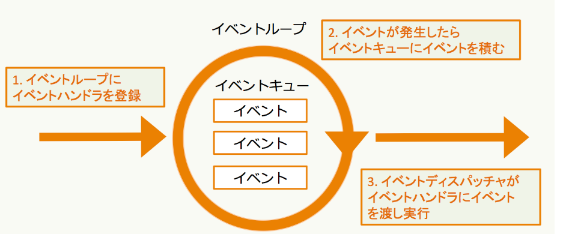

# 非同期I/O
- プログラムは基本的にファイル読み書き、API待ち等のI/O処理中はプログラムはブロックされる。これを同期I/O(ブロッキングI/O) と呼ぶ。

- ブロックしないようにI/O処理することを 非同期I/O(ノンブロッキングI/O) と呼ぶ。
    - 正確には ノンブロッキングI/O と 非同期I/O は定義が異なるが、最初は同じようなものという理解で良い。詳細は[ノンブロッキングI/Oと非同期I/Oの違いを理解する](https://blog.takanabe.tokyo/2015/03/ノンブロッキングi/oと非同期i/oの違いを理解する/)を参照。

# フロー駆動型プログラムとイベント駆動型プログラム
## フロー駆動型プログラム
- プログラムは上から下へ実行される。フローを記述することになるので，フロー駆動型プログラムと呼ばれる。

## イベント駆動型プログラム
- イベントに対して、実行される内容が変化するプログラムをイベント駆動型プログラムと呼ぶ。
- フローの代わりにイベントに応じたコードを書く。
- プログラムに必要なことは，イベントの監視とそのイベントの処理。
- イベントの監視と動作内容をあわせて，イベントハンドラと呼ぶ。
- 非同期処理はイベント駆動型プログラミング。

# イベントループ
イベント駆動プログラミングで利用される。イベントが発生したかどうかを監視するためのものがイベントループ。イベントは下記のようなもの。
- ファイルが読み書きできる
- ソケットが読み取り可能になる
- シグナル（APIレスポンス）を受け取る
- 設定したタイマー

## イベントループの動作
1. 事前にイベントに対応する イベントハンドラ を イベントループ に登録。
2. イベントが発生したら イベントキュー に入れて管理。
3. イベントディスパッチャー が イベントハンドラ を実行する。

# コルーチン
***処理を任意のタイミングで中断/再開できる処理***。Pythonではジェネレータが中断・再開できる処理となる。

Python3.4まではジェネレータを利用してコルーチンを作成（ジェネレータベースドコルーチン）。Python3.5からは専用の`async/await構文` (ネイティブコルーチン) が利用可能。